&BEYOND EAST AFRICA
DISCOVER NGORONGORO CRATER
DISCOVER
Zanzibar
Steeped in culture and history,
Zanzibar is fondly known as the
‘Spice Island’ due to the variety of
spices grown here. Stone Town,
a World Heritage Site, boasts
bustling market places, beautifully
carved wooden doors, mosques
and grand Arab residences.

&BEYOND EAST AFRICA
DISCOVER ZANZIBAR
Why Visit Zanzibar?
Discover a labyrinth of winding streets in Stone Town, pristine
beaches, azure waters, culture, history, spices, exquisite doors
and the silhouette of dhows against a golden sunset.
2 4
1
CULTURE AND CHARM EASY ACCESS TO
3
The combination of Arabic and THE SAFARI CIRCUIT
African cultures on this island lend This island escape, boasting azure
FASCINATING HISTORY itself to the simple bustle of everyday water and white sandy beaches
Delve into the beauty and ancient life. A relaxed atmosphere exudes, is within easy access to the East
history of Zanzibar in the UNESCO and you’ll find it a great place to EXPLORE THE SPICE ISLAND Africa safari circuit. With flights
World Heritage Site of Stone Town. unwind. At low tide, you can watch World-renowned for its aromatic via the Northern and Southern
Explore magnificent architecture, a men going out to fish and women spices, this once significant trading Tanzania circuit daily and from
labyrinth of bustling narrow alleys, cultivating seaweed. At high tide hub is a fragrant historical treasure Nairobi weekly it is the perfect
sand and coral-stone houses, some children are busy playing and trove of vanilla, cloves, turmeric, add on to a safari. With a variety
over 200 years old, with intricately running on the beach. nutmeg and cinnamon. Thrown of island lodges and resorts, this is
carved Arab and Indian doors and gain into this heady mix are areas where the perfect destination for families,
insight into the darker era of the Arab a variety of intriguing plants and friends and honeymooners alike.
slave trade. shrubs including the iodine plant and
the red fruit of the lipstick tree are
grown for medicinal purposes and
cosmetics.

&BEYOND EAST AFRICA
DISCOVER ZANZIBAR
Why travel with
&Beyond?
1
TRAVEL WITH HEART
Our core ethos of "Care of the
Land, Wildlife & People" drives
all that we do. When you travel
with us you make a meaningful
contribution to the preservation
of our world's cultures and wildlife
and leave with an opportunity
to gain first-hand experience in
some of our conservation and 4 TRAVEL EXPERTS
community initiatives. Big or small we are all about
tailoring trips around your specific
interests and expectations. Our
expert travel specialists are able to
2
IN OUR HANDS personalise a range of experiences
We are on call 24/7 to assist you for individual travellers, groups,
throughout your journey. Over families, wedding parties, and
2000 &Beyonders, including guides special interest groups.
and ground logistic teams on 3
continents, means that you are in
our hands from the moment you
5 PERFECT MOMENTS
arrive to the moment you leave.
With journeys lovingly crafted of
Additionally, we offer a personal
perfect moments, you will return
concierge service that is only a
from an &Beyond adventure feeling
phone call away should you require
that nothing will take your breath
any assistance at any point during
away quite like this ever again. Our
your trip. collection of signature experiences
are often exclusive to &Beyond,
ensuring a unique adventure.
3
FINEST GUIDES
We operate three ranger training
schools and are renowned for
having the most highly trained, What can I say! It was perfect! The island
professional and knowledgeable
guides, rangers, naturalists and is surreal, amazing blue ocean, the reef
trackers, who offer cultural insights
as well as interpretive wildlife nearby is full of bright fishes.
experiences. ”
&BEYOND GUEST

&BEYOND EAST AFRICA
Ethiopia
DISCOVER ZANZIBAR
|     |     |     |     |     |     |     | South Sudan |     |     |     | SIBILOI  |     |     |
| --- | --- | --- | --- | --- | --- | --- | ----------- | --- | --- | --- | -------- | --- | --- |
NP SOUTH
KIDEPO
|     |     |     |     |     |     |     |     | VALLEY  |     |     | Lake Turkana |     |     |
| --- | --- | --- | --- | --- | --- | --- | --- | ------- | --- | --- | ------------ | --- | --- |
MARSABIT
| Travel Zanzibar |     |     |     |     |     |     | MURCHISON  |     |     |     |     |     |     |
| --------------- | --- | --- | --- | --- | --- | --- | ---------- | --- | --- | --- | --- | --- | --- |
FALLS NP
|     |     |     |     |     |     |     | Uganda |     |     |     |     | Kenya | Somalia |
| --- | --- | --- | --- | --- | --- | --- | ------ | --- | --- | --- | --- | ----- | ------- |
             and beyond
|     |     |     |     |     | MWANZA | KIBALE N | P        |       |           |     | SAMBURU |     |     |
| --- | --- | --- | --- | --- | ------ | -------- | -------- | ----- | --------- | --- | ------- | --- | --- |
|     |     |     |     |     |        |          | K AMPALA | JINJA | KAKAMEGA  |     | Loisaba |     |     |
FOREST
|     |     |     |     |     |     |     |     | ENTEBBE | KISUMU |     | Lewa | MERU |     |
| --- | --- | --- | --- | --- | --- | --- | --- | ------- | ------ | --- | ---- | ---- | --- |
MOUNT
|                                                       |     |     |     |     |                    |                     |               |        |            |     | KENYA NP    | KORA |     |
| ----------------------------------------------------- | --- | --- | --- | --- | ------------------ | ------------------- | ------------- | ------ | ---------- | --- | ----------- | ---- | --- |
|                                                       |     |     |     |     |                    |                     | Lake Victoria |        | MIGORI     |     |             |      |     |
|                                                       |     |     |     |     |                    | BWINDI              |               |        |            |     | ABERDARE NP |      |     |
| Visiting East Africa and travelling across this vast  |     |     |     |     |                    | I M P E N E TRABLE  |               |        |            |     |             |      |     |
|                                                       |     |     |     |     |                    | F O R E S T         |               | TARIME | 2          | 1   | NAIROBI     |      |     |
|                                                       |     |     |     |     | RwVaOnLCAdNOaES NP |                     |               |        | MASAI MARA |     |             |      |     |
MUSOMA
| landscape requires much thought and attention.  |     |     |     |     |     |        |     |     |     | 3   |     |     |     |
| ----------------------------------------------- | --- | --- | --- | --- | --- | ------ | --- | --- | --- | --- | --- | --- | --- |
|                                                 |     |     |     |     |     | KIGALI |     |     | 4   |     |     |     |     |
5
| Contact your preferred travel specialist to assist  |     |     |     |     |                 |     |        |              |     |               | AMBOSELI      |               |     |
| --------------------------------------------------- | --- | --- | --- | --- | --------------- | --- | ------ | ------------ | --- | ------------- | ------------- | ------------- | --- |
|                                                     |     |     |     |     |  NYUNGWE FOREST |     | MWANZA |              |     | NOGORONGORO   |               | TSAVO EAST NP |     |
|                                                     |     |     |     |     |                 |     |        | SERENGETI NP |     | CONSERVATION  | TSAVO WEST NP |               |     |
|                                                     |     |     |     |     | Burundi         |     |        |              |     | AREA ARUSHA   |               |               |     |
| with your travel plans.                             |     |     |     |     |                 |     |        |              |     | 6             | KILIMANJARO   |               |     |
MOSHI
7 L M A A K N E Y   ARA NP
MOMBASA
TARANGIRE NP
KIGOMA
PEMBA
|     |     |     |     |     |     |     |     | Tanzania |     |     |     |     | INDIAN |
| --- | --- | --- | --- | --- | --- | --- | --- | -------- | --- | --- | --- | --- | ------ |
OCEAN
8
|                 |     |     |     |     |     | MAHALE       |     |     |     | DODOMA |     | ZANZIBAR |     |
| --------------- | --- | --- | --- | --- | --- | ------------ | --- | --- | --- | ------ | --- | -------- | --- |
| GETTING THERE   |     |     |     |     |     | MOUNTAINS NP |     |     |     |        |     |          |     |
DAR ES SALAAM
|     |     |     |     |     |     |     | KATAVI NP | RUNGWA NP |     |     |     |     |     |
| --- | --- | --- | --- | --- | --- | --- | --------- | --------- | --- | --- | --- | --- | --- |
Coastal Aviation, Auric Air and
| Regional Air Services offer daily  |     |     |     |     | DRC |     |     |         | RUAHA  NP |        |     |     |     |
| ---------------------------------- | --- | --- | --- | --- | --- | --- | --- | ------- | --------- | ------ | --- | --- | --- |
| departures from Arusha and Dar     |     |     |     |     |     |     |     |         |           | IRINGA |     |     |     |
| es Salaam. These flight networks   |     |     |     |     |     |     |     | USUNGU  |           |        |     |     |     |
GAME RESERVE
| link all of the major parks,  |     |     |     |     |     |     |     |     |     |     | SELOUS       |     |     |
| ----------------------------- | --- | --- | --- | --- | --- | --- | --- | --- | --- | --- | ------------ | --- | --- |
| reserves and &Beyond lodges.  |     |     |     |     |     |     |     |     |     |     | GAME RESERVE |     |     |
MBEYA
Zambia
Daily non-direct flights connect
the same parks, reserves and
&Beyond lodges to Zanzibar.
QUIRIMBAS
|     |     |     |     |     |     |     |     |     |     |     |     | MOCIMBOA DA PRAIA | ARCHIPELEGO |
| --- | --- | --- | --- | --- | --- | --- | --- | --- | --- | --- | --- | ----------------- | ----------- |
Malawi
Mnemba Island Lodge collects
| guests at Zanzibar International   | TRAVEL TIMES |     |     |     |     |     |     |     |     |            |     |     |          |
| ---------------------------------- | ------------ | --- | --- | --- | --- | --- | --- | --- | --- | ---------- | --- | --- | -------- |
| Airport or in Stone Town,          |              |     |     |     |     |     |     |     |     | Mozambique |     |     |          |
| followed by a 1.5 hour road trip,  | ZANZIBAR     |     |     |     |     |     |     |     |     |            |     |     | &BEYOND  |
and a 10 – 15 minutes boat ride
| in an open ski boat. | 1hr 30min | ARUSHA |               |     |     |     |     |     |     |     |     |     | LODGES |
| -------------------- | --------- | ------ | ------------- | --- | --- | --- | --- | --- | --- | --- | --- | --- | ------ |
|                      | 20min     | 2hrs   | DAR ES SALAAM |     |     |     |     |     |     |     |     |     | KENYA  |
Flight networks in Tanzania
| connect to the Masai Mara via  |     |     |     |     |     |     |     |     |     |     |     |     | 1   Bateleur Camp |
| ------------------------------ | --- | --- | --- | --- | --- | --- | --- | --- | --- | --- | --- | --- | ----------------- |
2    Kichwa Tembo Tented Camp
| two points, one via Kilimanjaro  | 4hrs | 6hrs 20min | 4hrs JOHANNESBURG |     |     |     |     |     |     |     |     |     |     |
| -------------------------------- | ---- | ---------- | ----------------- | --- | --- | --- | --- | --- | --- | --- | --- | --- | --- |
and Wilson Airport in Nairobi, and
TANZANIA
the other via Tarime and Migori.
|     | 1hr 15min | 2hrs | 4hrs 4hrs | NAIROBI |     |     |     |     |     |     |     |     | 3   Kleins Camp |
| --- | --------- | ---- | --------- | ------- | --- | --- | --- | --- | --- | --- | --- | --- | --------------- |
4    Grumeti Serengeti Tented Camp
| Flights connect to Kigali via  |     |     |     |     |     |     |     |     |     |     |     |     | 5   S erengeti Under Canvas |
| ------------------------------ | --- | --- | --- | --- | --- | --- | --- | --- | --- | --- | --- | --- | --------------------------- |
Mwanza and to Entebbe via
6    Ngorongoro Crater Lodge
Musoma.  * Poor connection due to: Layover time / no connection / peak periods only / private charter required. ** Includes flight to Manyara and 2hr road transfer time. Disclaimer: All flights may  7   L ake Manyara Tree Lodge
|     | in c l u d e   m u l ti p l e   | s to p s  a n d   s c h e d | u l i n g   is   a  g u id e l i n e   –  t im e s   w ill  v a ry   a | n d   sc h e d u li n g   is   c | o o r d in a t e d  mainly by operations teams on the ground. Flight schedules are more limited in off -peak  |     |     |     |     |     |     |     |     |
| --- | ------------------------------- | --------------------------- | ---------------------------------------------------------------------- | -------------------------------- | ------------------------------------------------------------------------------------------------------------- | --- | --- | --- | --- | --- | --- | --- | --- |
p e r i o d s .  A b o v e   t i m e s  a re   b a s e d   o n   b e s t - p r ac t ic e   l o g i st ic s  a n d  e x c lu d e   tr a n sf e r s  to   a n d   f r o m   lo d g e s . 8   Mnemba Island

&BEYOND EAST AFRICA
DISCOVER ZANZIBAR
Regional
information
ZANZIBAR
Altitude Sea level
Malaria area The island is situated in a low risk malaria area
Airstrip / Helipad No airstrip, closest airstrip is Zanzibar
GPS coordinates S 05˚49.218’ E 039˚22.959’
The best time to visit this tropical island is June to October during the cool, dry
Best time to travel
months of spring or December to February when it's hot and dry
Weather The weather can be humid, although sea breezes bring cooler air and relief from
heat and humidity
Temperature averages Average daytime temperatures are 26˚C / 79˚F from June to October and 28˚C
/ 82˚F from December to February. Average water temperature is from 25˚C /
77˚ to 29˚C / 84˚F
It is definitely barefoot luxury with open
bandas with no windows allowing the
sea breeze to blow through and you to be
woken by natural light.
”
&BEYOND GUEST

&BEYOND EAST AFRICA
DISCOVER NGORONGORO CRATER
DISCOVER ZANZIBAR
&Beyond
Mnemba Island
This romantic, barefoot-island haven in the Zanzibar
Archipelago is committed to a legacy of community
upliftment and marine conservation.

&BEYOND EAST AFRICA
DISCOVER ZANZIBAR
&Beyond Mnemba Island
Why stay?
1
INTIMATE, EXCLUSIVE AND
FLEXIBLE ISLAND GETAWAY
&Beyond Mnemba Island is an
idyllic tropical gem located off the
north-eastern tip of Zanzibar. 12
luxuriously rustic palm-frond bandas
peep out onto white coral sand
beach from the dappled shade of
the casuarina pine forest. Inhabited
only by &Beyond guests and the staff 3
CONSERVATION ON
taking care of them, the tiny island
YOUR DOORSTEP
is just 1.5 km (less than a mile) and
&Beyond Mnemba Island is known
is the ultimate escape. The size of
for its coral atoll and the calm
the island makes for an intimate and
azure seas, boasting irresistible
relaxing experience. Choose exactly
swimming directly from the beach.
how and where you would like to
Venture just 10 minutes away on a
spend your day and our team will
motorboat to find snorkeling spots
make it happen.
with kaleidoscopic marine life. As a
significant breeding site for green
turtles, Mnemba Island team patrol
2 the beaches daily to monitor and
CONNECT & RE-AWAKEN
record new turtle activity. The island
YOUR SOUL
has also become a new home for
Barefoot serenity and romance is the
two unique antelope species, Ader’s
allure of &Beyond Mnemba Island.
duiker and suni antelope, through
Take the time to rejuvenate and heal
our successful protection project.
in true African style. Just escaping to
this haven is soul soothing, with the
open style design, the natural world
is integrated into the lodge. Creating
a holistic connection, engage
in a wide range of wellness and
spiritually awakening activities that
draw inspiration from the scenery All the complexities of life are stripped away, leaving only
of this unique island. Delight your
taste buds in the simple and exuding crystal turquoise waters, cool white beaches, a friendly
essence of Zanzibar’s richness,
fragrance, history and soul through jungle. It is the perfect place to wash up on with your
our organic and freshly-prepared
food, inspired by barefoot beach special companion.
”
simplicity like the island itself.
&BEYOND GUEST

&BEYOND EAST AFRICA
DISCOVER NGORONGORO CRATER
DISCOVER MNEMBA ISLAND
Adventures
of a lifetime
Island experiences set against a backdrop of azure seas,
white sandy beaches and the kaleidoscopic culture and
history of Zanzibar that is woven into this space.

&BEYOND EAST AFRICA
DISCOVER ZANZIBAR
Adventures of a lifetime
OTHER ACTIVITIES
TO ENJOY
Experiences and
Go beyond the expected in the Zanzibar Archipelago with SCUBA DIVING
Diving around Zanzibar features
shallow coral gardens, walls
highlights adventures of a lifetime at &Beyond Mnemba Island. adorned with spiral corals, tropical
fish species, perfect underwater
visibility and some of the best dive
sites in the world.
SCUBA DIVING COURSES
A great variety of dive sites and
calm waters offers the ideal place
to scuba dive. Refresher courses
and a beginner three day Open
Water course are offered.
COMMUNITY VISIT
Gain insight into local communities
on Zanzibar that play an integral
part in reef conservation and
depend on these sources of fish for
their livelihood.
DOLPHIN BOAT TRIP
Jump into a boat to search for
2 4 pods of females and their calves
that inhabit the warm, tropical
waters. The playful bottlenose
dolphin is the most frequently
encountered dolphin here.
1 3 5
WELLNESS TREATMENTS GREEN TURTLE NESTING
&Beyond Mnemba AND HATCHING STONE TOWN
Island offers the perfect &Beyond Mnemba Island HISTORICAL TOUR
Delve into the beauty and ancient
opportunity to simply is an important green history of Zanzibar and explore
YOGA unwind and reconnect with SUNSET DHOW CRUISE turtle breeding site and the WATER ACTIVITIES architecture, a labyrinth of bustling
Channel your energy, yourself and your loved Relax in the romance of dusk conservation team work OFF THE BEACH narrow alleys and sand and
coral-stone houses with intricately
balance your chakras ones. Pamper yourself with surrounded by a vast expanse hard to protect and monitor Grab a snorkel, mask and a carved Arab and Indian doors.
and increase your self- a soul-soothing wellness of sky above and ocean blues turtle nests throughout the set of fins and explore the
awareness against the treatment in the comfort as your dhow glides towards year. Track the footprints of kaleidoscopic coral reefs
SPICE TOUR
backdrop of a pristine ocean of your banda with Healing the sunset. Be captivated by female turtles at night and around &Beyond Mnemba Follow the scent of vanilla, clove,
with a yoga class. Classes Earth products, made the evening colours, from observe their nests during Island. Take out a kayak or turmeric, nutmeg and cinnamon
can be accommodated to fit from all natural ingredients pink hues to burning orange, the year-round nesting try your hand at stand-up- as you drive through the lush
all levels of experiences and sourced in Africa. with slashes of deep indigo season, peaking between paddle boarding. Guests g g r ro ee w n in e g ry a o re f a th s. e island’s spice
preferred style and can be and azure descending into April and August. can set off on either a
taken in private or as part of inky black. guided or a solo adventure
a group. in the tranquil waters
surrounding the island. Activities may incur an additional
charge and may need to be booked
in advance

&BEYOND EAST AFRICA
DISCOVER ZANZIBAR
Adventures of a lifetime
Seasonal
highlights
ACTIVITIES
JAN FEB MAR APR MAY JUN JUL AUG SEP OCT NOV DEC
Yoga and wellness escape
Dining on the beach under the stars
Swimming and snorkeling straight from
the beach
Scuba diving
Migrating humpback whales in Zanzibar
Experiencing turtle nesting
Turtle hatchlings
Quieter reefs and more exclusive diving
SEASONAL RATES* $$$ $$$ $$$ $$ $$ $$$ $$$ $$$ $$$ $$ $$ $$$
* The $ / $$ / $$$ references are used to indicate rate variation and are not associated with specific values.
We have been to a lot of amazing place
but this island is very special and will
remain on our memory for ever.
”
&BEYOND GUEST

&BEYOND EAST AFRICA IMPACT
INITIATIVES
DISCOVER ZANZIBAR
&Beyond Mnemba Island We collaborate closely with
the Africa Foundation on
community development
programmes:
Over USD 420 000 invested
Lodge amenities since 2006 into education and
healthcare in neighbouring
communities.
Community Leaders Education
Fund: 42 tertiary level students
supported through bursaries.
Conservation lessons: Creating
awareness through education
where over 130 children and
adults partake annually.
We are creating conservation
awareness through education
where over 203 children and
adults partake annually
79% of our team are employed
from local communities.
2 4 79% of goods are procured
locally in Tanzania.
We purify our own still and
1 3 5 sparkling water on site, at our
SIGNATURE BEACH SHOP IN ROOM WELLNESS water purification plant, using
The island has an air- AND YOGA recycled glass bottles.
Through this we have completely
conditioned signature In season we have two eliminated the use of plastic
shop, which is a celebration internationally qualified water bottles in the lodge.
DIVE CENTER of East African high end PRIVATE BUTLER SERVICE wellness staff who are DINING LOCATIONS
The island features two dive beachwear, jewellery and Your wish is our command available for treatments Enjoy your meals in a variety In 2006 five Aders’ duiker were
centers - one on the North accessories. Also stocked with a personal butler on with natural Healing Earth of al freso locations such as introduced to &Beyond Mnemba
of the Island and one on the are rash vests and beach hand to ensure a seamless products and private yoga the beach, under the trees, o Is f l a t n h d is . , S th in e c r e a t r h es e t n a , n th te e l o p p o e p ulation
south, used in accordance necessities such as hats and experience and bring nibbles classes in the comfort of in the thatched dining area species in Africa, has increased
with the weather patterns, sunscreen. and cocktails to your banda your beach banda. or privacy of your room or to approximately 35.
stocked with equipment for with discrete but impeccable beach sala.
diving, snorkeling, kayaking personal service. Recycling: All plastic, glass, and
and SUP. The island has materials such as old engine oil
are sent away for re-use and
a PADI dive school and
recycling.
qualified dive instructors.
Energy measurement &
management: Energy use
is tracked and reported on a
monthly basis. This includes
the use of wood, petrol, diesel,
electricity, gas, paraffin and
charcoal.
We take steps to conserve water,
including monitoring usage
closely

HOUSE REEF
&BEYOND EAST AFRICA (INTREPID WATER SPORTS) 12
DISCOVER ZANZIBAR 11
&Beyond Mnemba Island
10
9
8
7
WALKING
TRAIL
6
BEACH
5 FAMILY BANDA
DINING AREA
GUEST
ARRIVAL
BAR
Mnemba Island
NORTH SIDE
DIVE CENTRE
4
INDIAN LIBRARY
OCEAN
ISLAND
SHOP Mangwapani
3
Zanzibar
2 WALKING Masingini
TRAIL Forest
Mnemba
STONE
TOWN
ISLAND Zanzibar Jozani
Airport Forest
SCENIC 1
VIEWPOINT
BOAT HOUSE/
SOUTH SIDE
DIVE CENTRE
BEACH &BEYOND
Mnemba Island
GUEST
ARRIVAL

&BEYOND EAST AFRICA
DISCOVER ZANZIBAR
&Beyond Mnemba Island
Lodge overview
FACILTIES
LODGE
| Maximum number of guests | 24  | Power           | 24 hour generator power |
| ------------------------ | --- | --------------- | ----------------------- |
| Number of rooms          | 12  | Internet access | Yes; Wi-Fi throughout   |
Family accommodation Link between two bandas which can be used as  Wine store or cellar No
a family banda
|                            |                      | Interactive kitchen | No                                            |
| -------------------------- | -------------------- | ------------------- | --------------------------------------------- |
| Room types                 | Banda                |                     |                                               |
|                            |                      | Swimming pool       | Ocean front - no pool                         |
| Distance between rooms     | 10 – 15m / 33 – 50ft |                     |                                               |
|                            |                      | Wellness offering   | Healing Earth treatments offered in-room only |
| Check in / Check out times | 14h00 / 10h00        |                     |                                               |
|                            |                      | Fitness             | Gym-in-a-Basket available in-room,            |
10 – 15 minute boat ride in an open ski boat. private yoga lessons, water sports – stand up
Boat transfers are weather dependent. Transfers  paddle boarding, kayak
Island access
are not available when it is dark - please speak
|     | to your travel specialist for more information. | Conference facilities | No                                       |
| --- | ----------------------------------------------- | --------------------- | ---------------------------------------- |
|     |                                                 | Weddings & blessings  | These can be organised- please consult   |
Seasonal closure in April and May; please
| Lodge closure |     |     | your travel specialist |
| ------------- | --- | --- | ---------------------- |
contact us for exact dates
Only if wheelchair is equipped with specialist
Wheelchair access
wheels for use on beach sand
DINING
|                        |                                         | Complimentary laundry service | Yes |
| ---------------------- | --------------------------------------- | ----------------------------- | --- |
| Food / Dietary options | Kosher not available. Halaal and other  |                               |     |
|                        |                                         | &Beyond Signature Beach Shop  | Yes |
special dietary requests available:
please book in advance
| Private butler service | Yes |     |     |
| ---------------------- | --- | --- | --- |
| Private dining         | Yes |     |     |
| Plated service         | Yes |     |     |
PAYMENT TYPES ACCEPTED
| Credit cards accepted | Mastercard and Visa                        |     |     |
| --------------------- | ------------------------------------------ | --- | --- |
| Currency              | USD are widely used, however, notes dated  |     |     |
prior to 2006 are not accepted

&BEYOND EAST AFRICA
DISCOVER ZANZIBAR
&Beyond Mnemba Island
Inclusions
RATE INCLUDES RATE EXCLUDES
Accommodation Administration fee
Three meals daily Telephone calls
Soft drinks, house wines, local brand spirit and Gratuities
beers, teas and coffees, and refreshments on
Personal items
lodge activities
Island shop purchases
Water sports (scuba diving – 2 dives per day – full
PADI certification required, snorkelling, kayaking, Champagne, cognacs, fine wines,
flyfishing, sundowner dhow cruise, and stand-up premium brand spirits, cigars
paddle boarding) subject to availability
Wellness and massage treatments
WILDchild programme
Yoga classes
Laundry
Weddings and blessings
Emergency evacuation insurance Diving instruction for guests under the age of
Return transfers between Zanzibar and Mnemba 12 years and adults without a PADI certificate
PADI Dive courses
Infrastructure tax of USD 1.00 pp/pn*
Park fees and government charges may apply.
Speak to your travel consultant for more details.
*per person per night
NOTE: Unmanned Aerial Vehicles: Please be advised that the use of unmanned aerial vehicles (Drones) are prohibited in the
conservation areas we manage, until such time as their impact on oceanlife and wildlife can be assessed. This rule will apply
throughout Africa, as our partners in various countries and regions have adopted a similar stance.

&BEYOND EAST AFRICA
DISCOVER ZANZIBAR
&Beyond Mnemba Island
WILDchild
FAMILY ACCOMODATION
Families and groups will fall in love with the tranquility of Two bandas are situated within close proximity to one
the island. We will only accommodate a maximum of two another and can accommodate a family of four (two adults
children under 12 years old at &Beyond Mnemba Island at any and two children).
given time. Travel to Zanzibar is recommended for children
eight years or older.
CHILD MINDING
WILDCHILD AT &BEYOND While we don’t have trained child minders, we can offer the
MNEMBA ISLAND services of certain staff members who are wonderful with
children. This will be at an additional cost.
Children visiting the lodge can take advantage of the fun-
filled and interactive WILDchild programme that offers various Please note: The lodge is not fenced off and children are required to have an
adult accompanying them at all times.
activities such as:
• A delightful scavenger hunt
• Embarking on a pirate ship trip around the island
• Snorkelling
• Beach picnics
• Nature walks
• Baking turtle biscuits with the lodge chef
The WILDchild activities, that were
both land and water based, were such
fun and kept my kids entertained from
morning till night. Such fun!
”
&BEYOND GUEST

&BEYOND EAST AFRICA
DISCOVER NGORONGORO CRATER
&BEYOND MNEMBA ISLAND
Naturally chic
beach bandas
The island offers 12 rustic palm-frond bandas
tucked into a tropical forest fringed by a white
coral sand beach. Relax and unwind on your
own stretch of beachfront.

&BEYOND EAST AFRICA
DISCOVER ZANZIBAR
&Beyond Mnemba Island accommodation
BANDA
12 beachside bandas / Maximum 24 guests
| A SPECTACULAR GEM | ROOM FACILITIES |     |
| ----------------- | --------------- | --- |
Mnemba Island offers
|     | Room size | 94 m² |
| --- | --------- | ----- |
12 rustic palm-frond
| bandas tucked into    | Personal bar     | Yes |
| --------------------- | ---------------- | --- |
| a tropical forest. A  | Private verandah | Yes |
covered walkway leads
|     | Air conditioning / heating | No  |
| --- | -------------------------- | --- |
to a shuttered ensuite
| bathroom with a glass-  | Overhead fans | Yes |
| ----------------------- | ------------- | --- |
| beaded shower curtain.  | Mosquito nets | Yes |
| Zanzibar is famous for  | Bath          | No  |
its woodcarvings and
|     | Shower | Yes |
| --- | ------ | --- |
the scrolled headboards
| adorning the beds are  | Seperate W.C. | Yes |
| ---------------------- | ------------- | --- |
created by some of the
|                        | Telephone | In-room telephones are       |
| ---------------------- | --------- | ---------------------------- |
| Island’s most skilled  |           | available. Intermittent GSM  |
mobile reception
artisans.
|     | Hairdryer    | Yes                      |
| --- | ------------ | ------------------------ |
|     | In-room safe | No                       |
|     | Plug type    | 220V AC (plug points in  |
rooms), Plug type G British
 – BS 1363
|     | Triple bed option | 1 (children 16 years and  |
| --- | ----------------- | ------------------------- |
younger)
|     | Twin bed option    | All convertible to double |
| --- | ------------------ | ------------------------- |
|     | Private beach sala | Yes                       |
tesolC
| BEACH LOUNGE | BEACH SALA |     |
| ------------ | ---------- | --- |
Outside
Shower
Approx. distance between
banda and lounge : 20m
Approx. distance : 10m

&BEYOND EAST AFRICA
DISCOVER ZANZIBAR
&Beyond Mnemba Island accommodation
FAMILY BANDA
1 family unit (2 bandas linked with a walkway)  / Maximum 2 adults & 2 children
| AN ISLAND ESCAPE | ROOM FACILITIES |     |
| ---------------- | --------------- | --- |
A family banda comprises
|     | Room Size | 94 m² |
| --- | --------- | ----- |
of a twin and double room
| that are situated close     | Personal bar     | Yes |
| --------------------------- | ---------------- | --- |
| together with an adjoining  | Private verandah | Yes |
wooden walkway. Each
|     | Air conditioning/heating | Yes |
| --- | ------------------------ | --- |
banda has its own ensuite
| bathroom and a private     | Overhead fans | Yes |
| -------------------------- | ------------- | --- |
| veranda and seating area.  | Mosquito nets | Yes |
| The family banda can       | Bath          | No  |
accommodate two adults
|     | Shower | Yes |
| --- | ------ | --- |
and two children (three
| children can be provided  | Seperate W.C. | Yes |
| ------------------------- | ------------- | --- |
for on request).
|     | Telephone | In-room telephones are  |
| --- | --------- | ----------------------- |
available. Intermittent GSM
mobile reception
|     | Hairdryer    | Yes                      |
| --- | ------------ | ------------------------ |
|     | In-room safe | No                       |
|     | Plug type    | 220V AC (plug points in  |
rooms), Plug type G British
 – BS 1363
|     | Triple bed option | 1 (children 16 years and  |
| --- | ----------------- | ------------------------- |
younger)
|     | Twin bed option      | All convertible to double |
| --- | -------------------- | ------------------------- |
|     | Interleading walkway | Yes                       |
|     | Private beach salas  | Yes                       |

&BEYOND EAST AFRICA
DISCOVER NGORONGORO CRATER
GENERAL ENQUIRIES
+27 11 809 4300
contactus@andBeyond.com
REGIONAL ENQUIRIES
Africa: africa.reservations@andBeyond.com
Asia: southasia.reservations@andBeyond.com
@andbeyondtravel
South America:
#seewhatliesbeyond
southamerica.reservations@andBeyond.com
andBeyond.com
PRESS ENQUIRIES
media@andBeyond.com
TRAVEL TRADE
enquiry@andBeyond.com

## Extracted Images

### Page 1

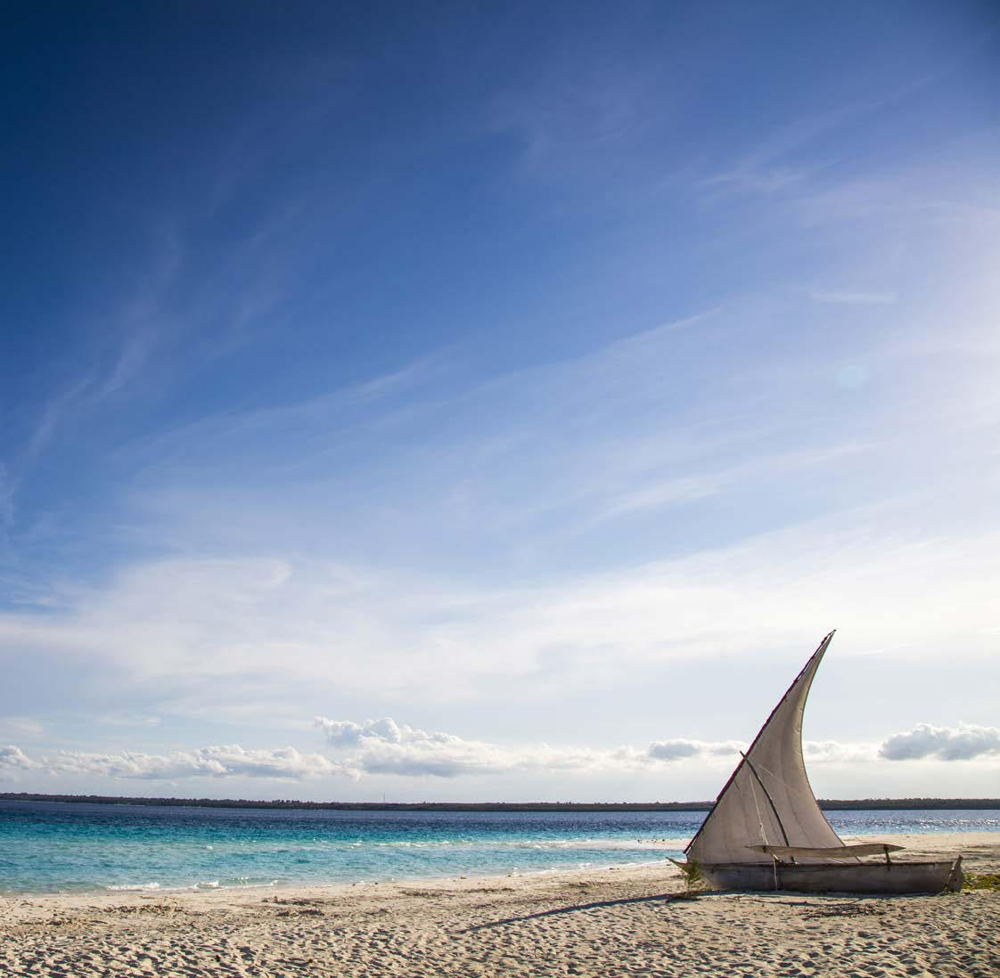

### Page 2

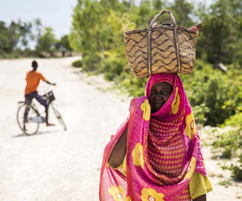
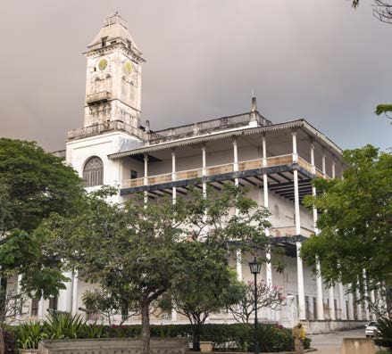
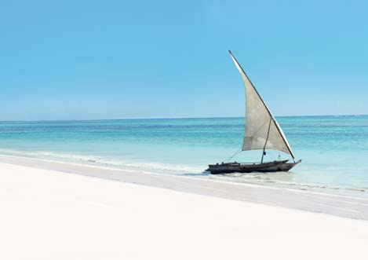
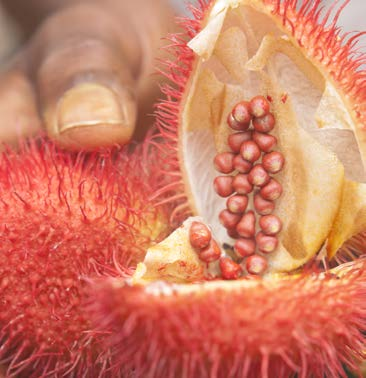

### Page 3

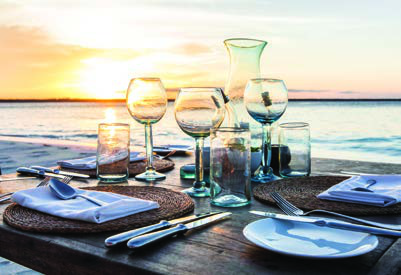
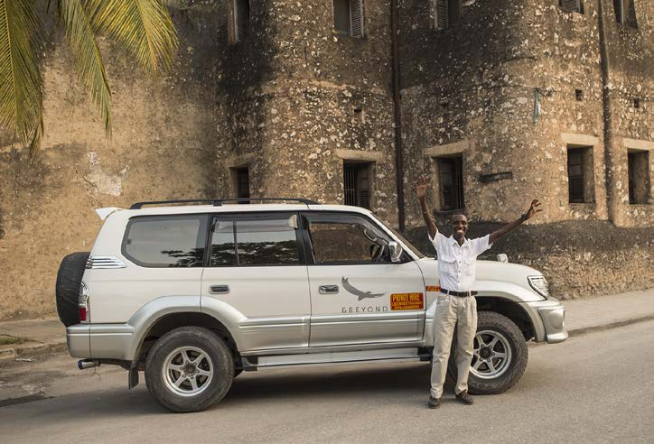
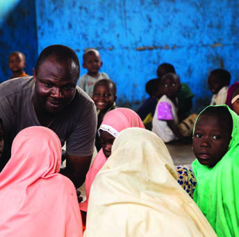

### Page 5

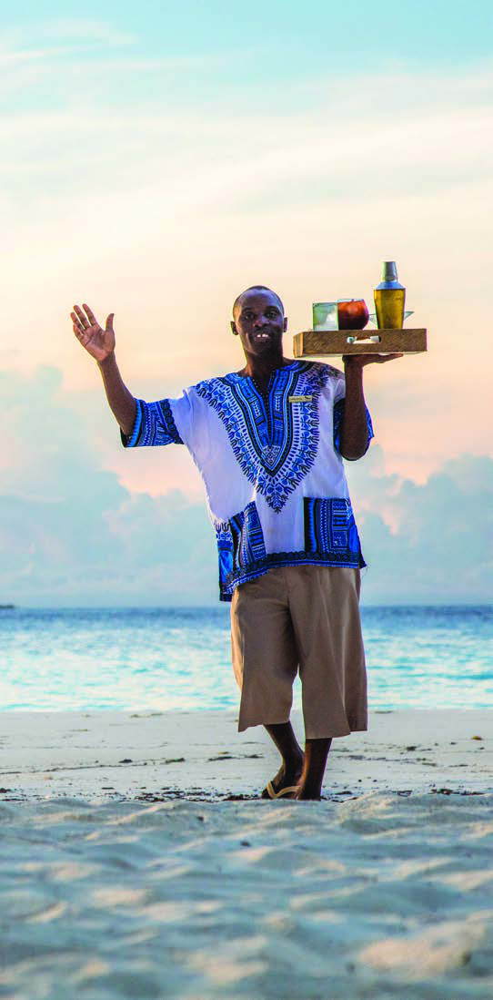

### Page 6

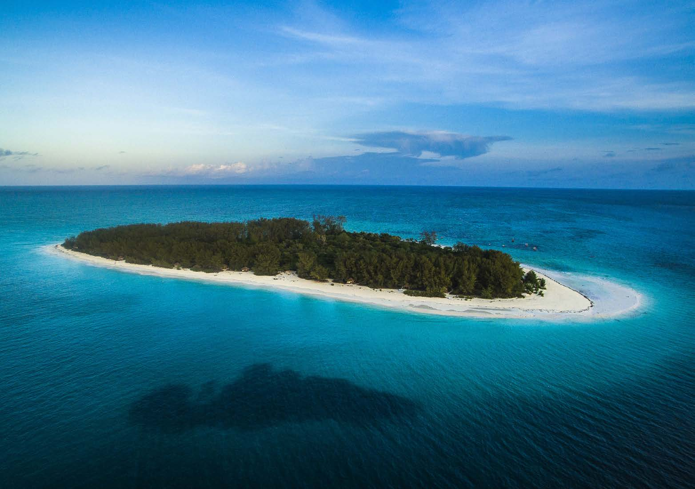

### Page 7

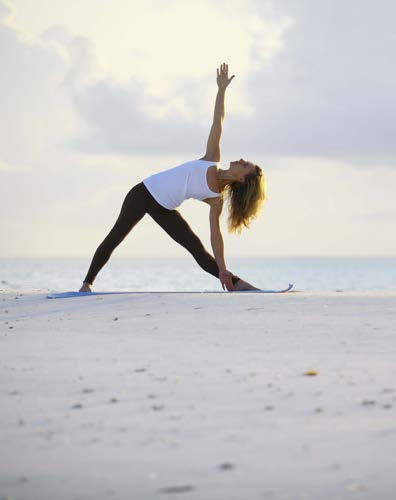
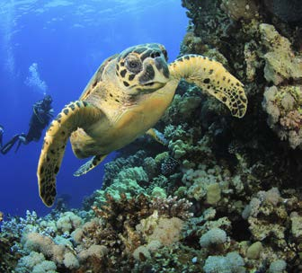
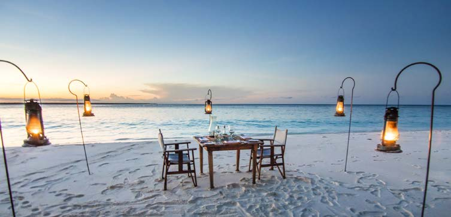

### Page 8

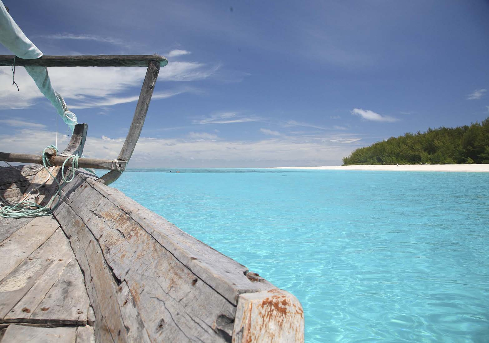

### Page 9

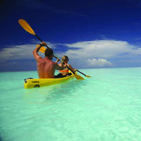
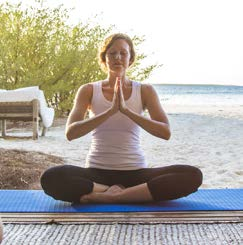
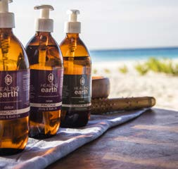
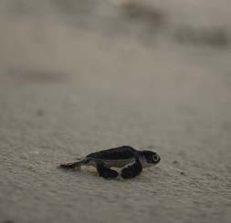
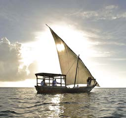

### Page 10

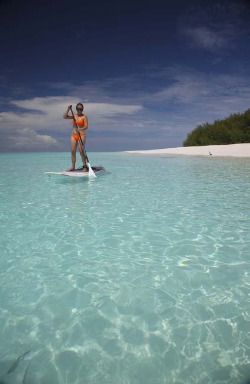
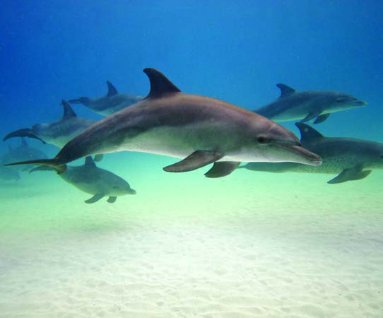

### Page 11

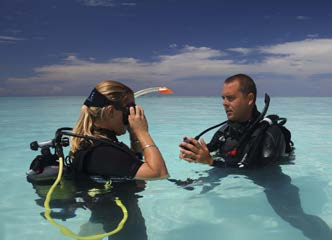
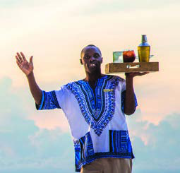
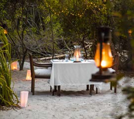
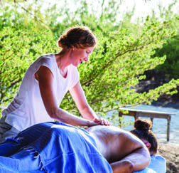
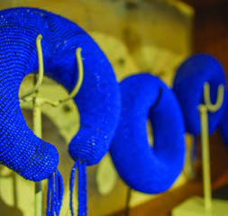

### Page 14

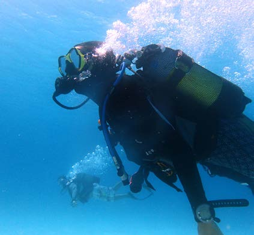
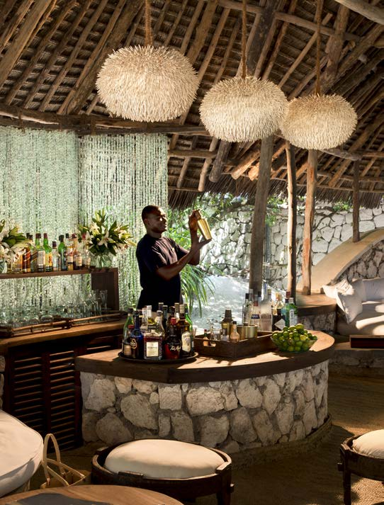

### Page 15

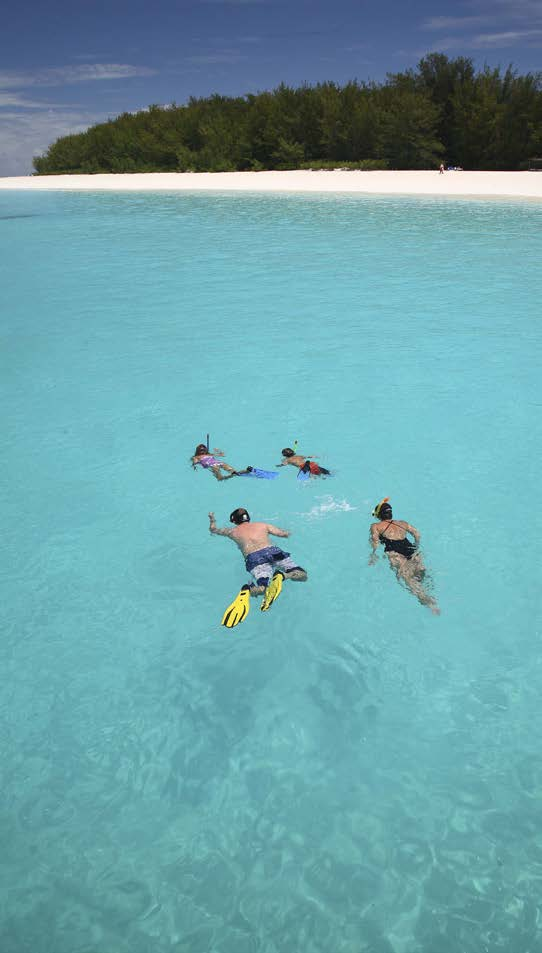

### Page 16

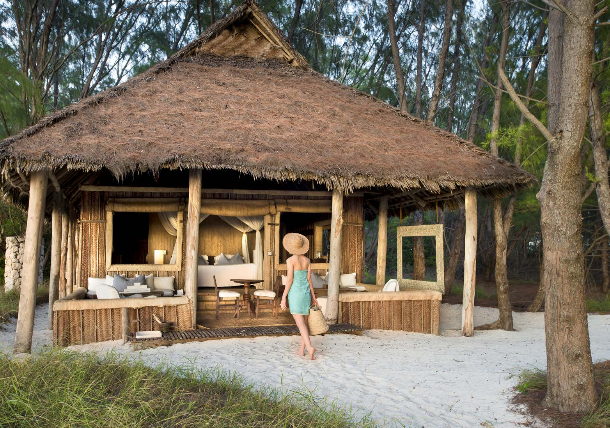

### Page 17

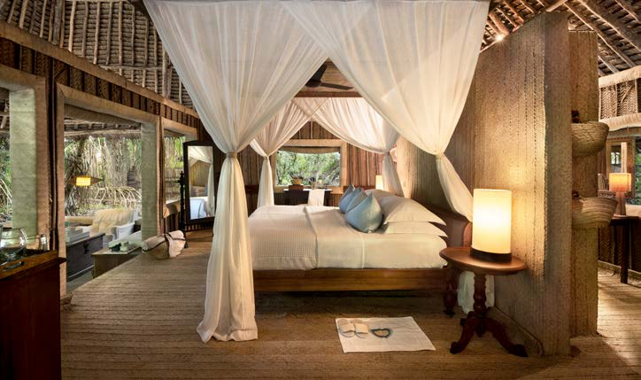

### Page 18

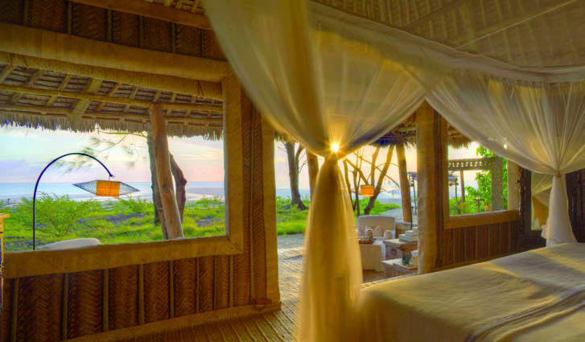

### Page 19

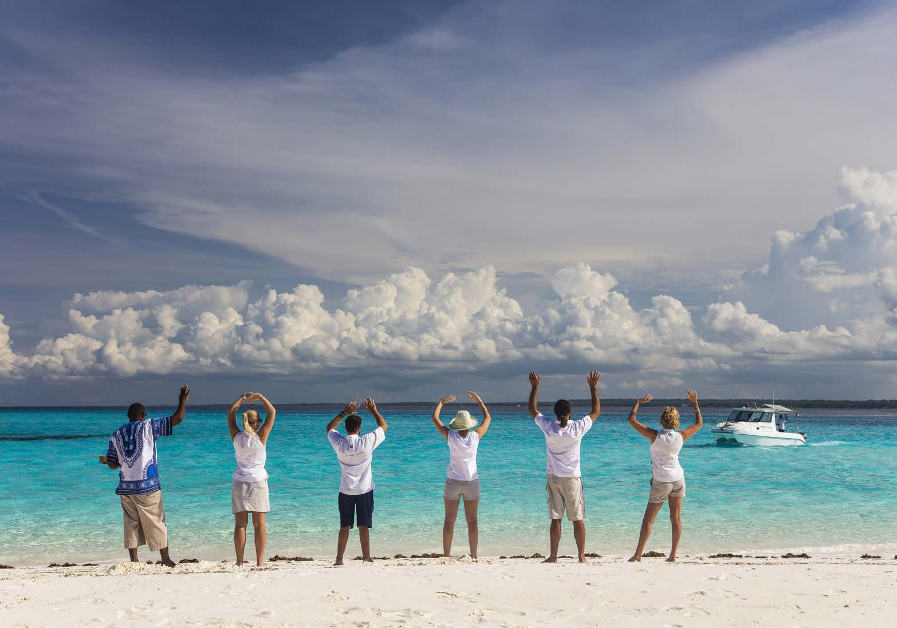
