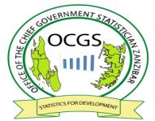

TOURISM STATISTICAL RELEASE DECEMBER 2025
Issued date – 08th December, 2025

TOURISM STATISTICS
Zanzibar recorded 100,729 international visitors in December 2025, an increase of 10.0 percent
compared with 91,611 visitors in December 2024 and increased by 38.3 percent compared with
72,833 visitors recorded in the preceding month (November 2025).
European tourists dominated the market by accounting for 68.1 percent of the total visitors in
December 2025. Country-wise, Italy dominated the tourism market by accounting for 14.4
percent of all visitors entered in December 2025, followed by French (6.9 percent), while
Japanese recorded less than one percent (0.3 percent), the least. Other performances are shown
in Table 1.
The data shows that in December 2025, a total of 92,421 visitors, equivalent to 91.7 percent of
the total visitors entered through the Airport of which 71,185 visitors entered by international
flights and 21,236 by domestic flights. The remaining 8,308 visitors entered through the seaport
whereby 61 visitors entered through a cruise ship and 8,247 entered through ferries from the
Tanzania Mainland, as shown in Figure 1 and Table 2.
Information on the purpose of visit (Table 3) shows that in December 2025, a total of 100,284
visitors, equivalent to 99.6 percent came for holidays, 0.3 percent for visiting friends and
relatives and 0.1 percent for other purposes.
Table 4 and Figure 2 show that 57,077 visitors (56.7 percent) were male and 43,652 ( 43.3
percent) were female. The number of males and females in December 2025 increased by 41.6
and 34.2 percent respectively compared with November 2025.
The ages of the visitors were categorized into three broad groups: those younger than 15 years
who are regarded as children, those 15 to 64 years who are regarded as the working age
population, and those 65 years and older who are considered retirees. The overall results show
that 9,156 visitors (9.1 percent) were aged less than 15 years, 85,331 visitors (84.7 percent)
were aged 15 to 64 years, and 6,242 visitors (6.2 percent) were aged 65 years and older (Figure
3 &Table 5).
The number of visitors from emerging markets in December 2025 (Poland, India, Russia,
Israel, China, and Ukraine) increased by 32.1 percent compared with the number of visitors
recorded in November 2025. Other performances are shown in (Figure 4 & Annex I).
1

Table 6 shows that a higher percentage of visitors (33.4 percent) stayed in the country for 7
days in December 2025. Visitors’ average intended length of stay in December 2025 was 8
nights.
A total of 884,430 bed spaces were available in December 2025. Estimates of 815,143 beds
were sold during December 2025, representing a bed occupancy rate of 92.2 percent (Table 7).
2

Table 1: International Visitors by Nationality December 2025, November 2025 and
December 2024.
|              |                |     |                |     |     |                 |     | % Change    |     | % Change,    |     |
| ------------ | -------------- | --- | -------------- | --- | --- | --------------- | --- | ----------- | --- | ------------ | --- |
|              |                |     |                |     |     |                 |     | December    |     | December     |     |
|              | December 2024  |     | November 2025  |     |     | December  2025  |     |             |     |              |     |
| Nationality  |                |     |                |     |     |                 |     | 2025 and    |     | 2025 and     |     |
|              |                |     |                |     |     |                 |     | November    |     | December     |     |
Number  %Share  Rank  Number  % Share  Rank  Number  % Share  Rank  2025  2024
| EUROPE  |     |     |     |     |     |     |     |     |     |     |     |
| ------- | --- | --- | --- | --- | --- | --- | --- | --- | --- | --- | --- |
 Scandinavian   4,065  4.4  8  2,123  2.9  10  4,446  4.4  6  109.4  9.4
 British   4,068  4.4  7  3,122  4.3  6  3,944  3.9  7  26.3  -3.0
 German   5,333  5.8  5  5,618  7.7  2  5,981  5.9  5  6.5  12.2
 Italian   12,552  13.7  1  8,892  12.2  1  14,519  14.4  1  63.3  15.7
 French   6,572  7.2  3  5,423  7.4  4  6,942  6.9  2  28.0  5.6
 Dutch   3,295  3.6  10  2,904  4.0  7  3,501  3.5  8  20.6  6.3
 Belgium   1,305  1.4  16  836  1.1  16  1,067  1.1  19  27.6  -18.2
 Russian   1,009  1.1  17  1,622  2.2  13  1,738  1.7  13  7.2  72.2
 Turkish   724  0.8  19  779  1.1  18  1,107  1.1  18  42.1  52.9
 Polish   5,916  6.5  4  5,540  7.6  3  6,727  6.7  3  21.4  13.7
 Ukrainian   1,622  1.8  12  772  1.1  19  1,175  1.2  17  52.2  -27.6
Czech Republic    3,234  3.5  11  2,526  3.5  8  2,906  2.9  10  15.0  -10.1
 Spanish
|     | 1,478  1.6  | 14  | 1,835  | 2.5  | 12  | 1,818  | 1.8  | 12  | -0.9  |     | 23.0  |
| --- | ----------- | --- | ------ | ---- | --- | ------ | ---- | --- | ----- | --- | ----- |
 Other European   11,226  12.3     11,217  15.4     12,750  12.7     13.7  13.6
 Subtotal   62,399  68.1     53,209  73.1     68,621  68.1
|         |       |     |     |     |     |     |     |     | 29  |     | 10  |
| ------- | ----- | --- | --- | --- | --- | --- | --- | --- | --- | --- | --- |
|  ASIA   |       |     |     |     |     |     |     |     |     |     |     |
|         |       |     |     |     |     |     |     |     |     |     |     |
 Japanese   174  0.2  24  98  0.1  24  307  0.3  24  213.3  76.4
 Chinese   982  1.1  18  921  1.3  14  1,263  1.3  16  37.1  28.6
 Indian   1,353  1.5  15  862  1.2  15  1,640  1.6  14  90.3  21.2
 Israeli   628  0.7  21  797  1.1  17  1,348  1.3  15  69.1  114.6
 Other Asian   2,109  2.3     1,987  2.7     2,958  2.9     48.9  40.3
 Subtotal   5,246  5.7     4,665  6.4     7,516  7.5     61.1  43.3
|  AFRICA   |       |     |     |     |     |     |     |     |     |     |     |
| --------- | ----- | --- | --- | --- | --- | --- | --- | --- | --- | --- | --- |
Kenyan   4,260  4.7  6  2,245  3.1  9  2,927  2.9  9  30.4  -31.3
South African   7,252  7.9  2  3,236  4.4  5  6,089  6.0  4  88.2  -16.0
Egyptian  261  0.3  22  366  0.5  22  508  0.5  23  38.8  94.6
Other African   4,989  5.4     5,108  7.0     9,062  9.0     77.4  81.6
 Subtotal   16,762  18.3     10,955  15.0     18,586  18.5     69.7  10.9
|  AMERICA   |       |     |     |     |     |     |     |     |     |     |     |
| ---------- | ----- | --- | --- | --- | --- | --- | --- | --- | --- | --- | --- |
American   4,006  4.4  9  2,081  2.9  11  2,820  2.8  11  35.5  -29.6
 Canadian   1,572  1.7  13  610  0.8  20  986  1.0  20  61.6  -37.3
 Other American    729  0.8     690  0.9     927  0.9     34.3  27.2
 Subtotal   6,307  6.9     3,381  4.6     4,733  4.7     40.0  -25.0
|  OCEANIA   |       |     |     |     |     |     |     |     |     |     |     |
| ---------- | ----- | --- | --- | --- | --- | --- | --- | --- | --- | --- | --- |
 Australian   699  0.8  20  521  0.7  21  688  0.7  21  32.1  -1.6
 New Zealand
|              | 180  0.2  | 23  | 102  | 0.1  | 23  | 585    | 0.581  | 22  | 473.5  |     | 225.0  |
| ------------ | --------- | --- | ---- | ---- | --- | ------ | ------ | --- | ------ | --- | ------ |
|  Subtotal    | 879  1    |     | 623  | 0.9  |     | 1,273  | 1.3    |     |        |     |        |
|              |           |     |      |      |     |        |        |     | 104.3  |     | 44.8   |
|  Not stated  | 18  0     |     | 0    | 0.0  |     | 0      | 0.0    |     |        |     |        |
TOTAL  91,611  100     72,833  100.0     100,729  100.0     38.3  10.0

3

Figure 1: International Visitors by Entry Points, December 2025
Total International Domestic
92,421
71,185
21,236
8,308 8,247
61
Airport Seaport
4

Table 2: International Visitors by Nationality through Entry Points, December 2025
|                              |     | Airport          |     |        |              | Seaport      |     |        |     |
| ---------------------------- | --- | ---------------- | --- | ------ | ------------ | ------------ | --- | ------ | --- |
| Nation ality  International  |     |                  |     |        |              |              |     |        |     |
|                              |     | Domestic Flight  |     | Total  | Cruise Ship  | Sea ferries  |     | Total  |     |
Flight
| EUROPE  |     |     |     |     |     |     |     |     |     |
| ------- | --- | --- | --- | --- | --- | --- | --- | --- | --- |
Scandinavian  2,880  1,177  4,057                0     389              389
| British  | 3,038  |     | 503  |     | 3,541  |  0     | 403  |             403   |     |
| -------- | ------ | --- | ---- | --- | ------ | ------ | ---- | ----------------- | --- |
| German   | 4,653  |     | 978  |     | 5,631  |  0     | 350  |             350   |     |
Italian  12,949  1,357  14,306                12   201              213
French  5,777  893  6,670                13   259              272
| Dutch    | 2,433  |     | 899  |     | 3,332  |  0     | 169  |             169    |     |
| -------- | ------ | --- | ---- | --- | ------ | ------ | ---- | ------------------ | --- |
| Belgium  | 831    |     | 189  |     | 1,020  |  0     | 47   |               47   |     |
Russian  1,459  208  1,667                12   59                71
| Turkish    | 551    |     | 471  |     | 1,022  |  0     | 85  |               85   |     |
| ---------- | ------ | --- | ---- | --- | ------ | ------ | --- | ------------------ | --- |
| Polish     | 6,063  |     | 597  |     | 6,660  |  0     | 67  |               67   |     |
| Ukrainian  | 757    |     | 406  |     | 1,163  |  0     | 12  |               12   |     |
Czech Republic  2,392  487  2,879   0     27                27
| Spanish  | 1,049  |     | 707  |     | 1,756  |  0     | 62  |               62   |     |
| -------- | ------ | --- | ---- | --- | ------ | ------ | --- | ------------------ | --- |
Other Europeans  8,950  3,414  12,364                12   374              386
| Subtotal  | 53,782  |     | 12,286  |     | 66,068  | 49     | 2,504  |                     | 2,553  |
| --------- | ------- | --- | ------- | --- | ------- | ------ | ------ | ------------------- | ------ |
| ASIA      |         |     |         |     |         |        |        |                     |        |
| Japanese  | 165     |     | 95      |     | 260     |  0     | 47     |               47    |        |
| Chinese   | 586     |     | 356     |     | 942     |  0     | 321    |             321     |        |
| Indian    | 733     |     | 492     |     | 1,225   |  0     | 415    |             415     |        |
| Israeli   | 898     |     | 444     |     | 1,342   |  0     | 6      |                 6   |        |
Other Asians  1,490  1,252  2,742   0     216              216
| Subtotal  | 3,872  |     | 2,639  |     | 6,511  | 0      | 1,005  |                   | 1,005  |
| --------- | ------ | --- | ------ | --- | ------ | ------ | ------ | ----------------- | ------ |
| AFRICA    |        |     |        |     |        |        |        |                   |        |
| Kenyan    | 1,885  |     | 133    |     | 2,018  |  0     | 909    |             909   |        |
South African  4,769  1,027  5,796   0     293              293
| Egyptian  | 326  |     | 136  |     | 462  |  0     | 46  |               46   |     |
| --------- | ---- | --- | ---- | --- | ---- | ------ | --- | ------------------ | --- |
Other Africans  3,535  2,670  6,205                12   2845           2,857
Subtotal
|           | 10,515  |     | 3,966  |     | 14,481  | 12     | 4,093  |                   | 4,105  |
| --------- | ------- | --- | ------ | --- | ------- | ------ | ------ | ----------------- | ------ |
| AMERICA   |         |     |        |     |         |        |        |                   |        |
| American  | 1,670   |     | 805    |     | 2,475   |  0     | 345    |             345   |        |
| Canadian  | 478     |     | 388    |     | 866     |  0     | 120    |             120   |        |
Other Americans  514  342  856   0     71                71
| Subtotal     | 2,662   |     | 1,535   |     | 4,197   | 0       | 536    |                     | 536    |
| ------------ | ------- | --- | ------- | --- | ------- | ------- | ------ | ------------------- | ------ |
| OCEANIA      |         |     |         |     |         |         |        |                     |        |
| Australian   | 288     |     | 301     |     | 589     |  0      | 99     |               99    |        |
| New Zealand  | 66      |     | 509     |     | 575     |  0      | 10     |               10    |        |
| Subtotal     | 354     |     | 810     |     | 1,164   | 0       | 109    |                     | 109    |
| Not stated   |         | 0   | 0       |     | 0       | 0       | 0      |               0     |        |
| TOTAL        | 71,185  |     | 21,236  |     | 92,421  | 61      | 8,247  |                     | 8,308  |

5

Table 3: International Visitors by Nationality and Purpose of Visit, December 2025
Visiting
|     |     | Friends and  |     | Seeking  | Temporary  | Business and  |     | In  |     |     |
| --- | --- | ------------ | --- | -------- | ---------- | ------------- | --- | --- | --- | --- |
Nationality  Holidays  Relatives  Employment  Employment  Conference  Transit  Others  Total
| EUROPE           |          |     |      |        |     |     |     |     |        |          |
| ---------------- | -------- | --- | ---- | ------ | --- | --- | --- | --- | ------ | -------- |
| Scandinavian     | 4,422    |     | 24   |  0     |     | 0   | 0   | 0   | 0      | 4,446    |
| British          | 3,931    |     | 9    |  0     |     | 0   | 0   | 0   | 4      | 3,944    |
| German           | 5,963    |     | 8    |  0     |     | 0   | 0   | 0   | 10     | 5,981    |
| Italian          | 14,498   |     | 9    |  0     |     | 0   | 0   | 0   | 12     | 14,519   |
| French           | 6,903    |     | 26   |  0     |     | 0   | 4   | 0   | 9      | 6,942    |
| Dutch            | 3,486    |     | 15   |  0     |     | 0   | 0   | 0   |  0     | 3,501    |
| Belgium          | 1,060    |     | 7    |  0     |     | 0   | 0   | 0   |  0     | 1,067    |
| Russian          | 1,738    |     | 0    |  0     |     | 0   | 0   | 0   |  0     | 1,738    |
| Turkish          | 1,107    |     | 0    |  0     |     | 0   | 0   | 0   |  0     | 1,107    |
| Polish           | 6,713    |     | 8    |  0     |     | 0   | 0   | 3   | 3      | 6,727    |
| Ukrainian        | 1,167    |     | 4    |  0     |     | 0   | 0   | 0   | 4      | 1,175    |
| Czech Republic   | 2,895    |     | 11   |  0     |     | 0   | 0   | 0   |  0     | 2,906    |
| Spanish          | 1,799    |     | 19   |  0     |     | 0   | 0   | 0   |  0     | 1,818    |
| Other Europeans  | 12,637   |     | 13   |  0     |     | 0   | 3   | 5   | 92     | 12,750   |
| Subtotal         | 68,319   |     | 153  | 0      |     | 0   | 7   | 8   | 134    | 68,621   |
| ASIA             |          |     |      |        |     |     |     |     |        |          |
| Japanese         | 307      |     | 0    |  0     |     | 0   | 0   | 0   |  0     | 307      |
| Chinese          | 1,248    |     | 15   |  0     |     | 0   | 0   | 0   |  0     | 1,263    |
| Indian           | 1,629    |     | 4    |  0     |     | 0   | 4   | 0   | 3      | 1,640    |
| Israeli          | 1,348    |     | 0    |  0     |     | 0   | 0   | 0   |  0     | 1,348    |
| Other Asians     | 2,958    |     | 0    |  0     |     | 0   | 0   | 0   |  0     | 2,958    |
| Subtotal         | 7,490    |     | 19   | 0      |     | 0   | 4   | 0   | 3      | 7,516    |
| AFRICA           |          |     |      |        |     |     |     |     |        |          |
| Kenyan           | 2,902    |     | 16   | 2      |     | 0   | 0   | 0   | 7      | 2,927    |
| South African    | 6,077    |     | 12   |  0     |     | 0   | 0   | 0   |  0     | 6,089    |
| Egyptian         | 508      |     | 0    |  0     |     | 0   | 0   | 0   |  0     | 508      |
| Other Africans   | 8,995    |     | 61   | 2      |     | 0   | 1   | 0   | 3      | 9,062    |
| Subtotal         | 18,482   |     | 89   | 4      |     | 0   | 1   | 0   | 10     | 18,586   |
| AMERICA          |          |     |      |        |     |     |     |     |        |          |
| American         | 2,809    |     | 6    |  0     |     | 0   | 0   | 0   | 5      | 2,820    |
| Canadian         | 986      |     | 0    |  0     |     | 0   | 0   | 0   |  0     | 986      |
| Other Americans  | 925      |     | 2    |  0     |     | 0   | 0   | 0   |  0     | 927      |
| Subtotal         | 4,720    |     | 8    | 0      |     | 0   | 0   | 0   | 5      | 4,733    |
| OCEANIA          |          |     |      |        |     |     |     |     |        |          |
| Australian       |          |     |      |  0     |     |     |     |     |  0     |          |
|                  | 688      |     | 0    |        |     | 0   | 0   | 0   |        | 688      |
| New Zealand      |          |     |      |  0     |     |     |     |     |  0     |          |
|                  | 585      |     | 0    |        |     | 0   | 0   | 0   |        | 585      |
| Subtotal         | 1,273    |     | 0    | 0      |     | 0   | 0   | 0   | 0      | 1,273    |
| Not stated       |          | 0   | 0    | 0      |     | 0   | 0   | 0   | 0      | 0        |
| TOTAL            | 100,284  |     | 269  | 4      |     | 0   | 12  | 8   | 152    | 100,729  |
TOTAL
| PERCENT  | 99.6  |     | 0.3  | 0.0  |     | 0.0  | 0.0  | 0.0  | 0.1  | 100  |
| -------- | ----- | --- | ---- | ---- | --- | ---- | ---- | ---- | ---- | ---- |

6

Table 4: International Visitors by Nationality and Sex, December 2025
| Nationality  |     | Male  |     | Female  |     | Total  |
| ------------ | --- | ----- | --- | ------- | --- | ------ |
EUROPE
|               |                  |     |                  |     |     |        |
| ------------- | ---------------- | --- | ---------------- | --- | --- | ------ |
| Scandinavian  |          2,786   |     |          1,660   |     |     | 4,446  |
| British       |          2,205   |     |          1,739   |     |     | 3,944  |
| German        |          3,479   |     |          2,502   |     |     | 5,981  |
Italian
|          |          8,271    |     |          6,248    |     |     | 14,519  |
| -------- | ----------------- | --- | ----------------- | --- | --- | ------- |
| French   |          4,047    |     |          2,895    |     |     | 6,942   |
| Dutch    |          2,003    |     |          1,498    |     |     | 3,501   |
| Belgium  |             616   |     |             451   |     |     | 1,067   |
| Russian  |             820   |     |             918   |     |     | 1,738   |
Turkish
|                 |             949   |     |             158   |     |     | 1,107  |
| --------------- | ----------------- | --- | ----------------- | --- | --- | ------ |
| Polish          |          3,649    |     |          3,078    |     |     | 6,727  |
| Ukrainian       |             550   |     |             625   |     |     | 1,175  |
| Czech Republic  |          1,675    |     |          1,231    |     |     | 2,906  |
| Spanish         |          1,045    |     |             773   |     |     | 1,818  |
Other European Countries           6,756            5,994   12,750
| Subtotal  |        38,851     |     |        29,770     |     |     | 68,621  |
| --------- | ----------------- | --- | ----------------- | --- | --- | ------- |
| ASIA      |                   |     |                   |     |     |         |
| Japanese  |             148   |     |             159   |     |     | 307     |
Chinese
|     |             792   |     |             471   |     |     | 1,263  |
| --- | ----------------- | --- | ----------------- | --- | --- | ------ |
Indian
|                |          1,143    |     |             497   |     |     | 1,640  |
| -------------- | ----------------- | --- | ----------------- | --- | --- | ------ |
| Israeli        |             995   |     |             353   |     |     | 1,348  |
| Other Asian    |          2,020    |     |             938   |     |     | 2,958  |
| Subtotal       |          5,098    |     |          2,418    |     |     | 7,516  |
| AFRICA         |                   |     |                   |     |     |        |
| Kenyan         |          1,527    |     |          1,400    |     |     | 2,927  |
| South African  |          3,058    |     |          3,031    |     |     | 6,089  |
| Egyptian       |             374   |     |             134   |     |     | 508    |
| Other African  |          4,702    |     |          4,360    |     |     | 9,062  |
Subtotal
|     |          9,661   |     |          8,925   |     |     | 18,586  |
| --- | ---------------- | --- | ---------------- | --- | --- | ------- |
AMERICA
|     |     |     |     |     |     |     |
| --- | --- | --- | --- | --- | --- | --- |
American
|                  |          1,638    |     |          1,182    |     |     | 2,820  |
| ---------------- | ----------------- | --- | ----------------- | --- | --- | ------ |
| Canadian         |             637   |     |             349   |     |     | 986    |
| Other American   |             417   |     |             510   |     |     | 927    |
| Subtotal         |          2,692    |     |          2,041    |     |     | 4,733  |
| OCEANIA          |                   |     |                   |     |     |        |
| Australian       |             451   |     |             237   |     |     | 688    |
| New Zealand      |             324   |     |             261   |     |     | 585    |
| Subtotal         |             775   |     |             498   |     |     | 1,273  |
Not stated
|     |     |  0     |     |  0     |     | 0   |
| --- | --- | ------ | --- | ------ | --- | --- |
TOTAL DECEMBER 2025
|     |        57,077   |     |        43,652   |     |     | 100,729  |
| --- | --------------- | --- | --------------- | --- | --- | -------- |
TOTAL NOVEMBER 2025
|     |     | 40,305  |     | 32,528  |     | 72,833  |
| --- | --- | ------- | --- | ------- | --- | ------- |
TOTAL PERCENT
|     |            56.7   |     |            43.3   |     |             100   |     |
| --- | ----------------- | --- | ----------------- | --- | ----------------- | --- |
% CHANGE, DECEMBER 2025 AND
NOVEMBER 2025
|     |     | 41.6  |     | 34.2  |     | 38.3  |
| --- | --- | ----- | --- | ----- | --- | ----- |

7

Figure 2: International Visitors by Sex, December 2025
Female
43.3%
Male
56.7%
Figure 3: International Visitors by Categorized Age, December 2025
6.2% 9.1%
84.7%
<15yrs 15-64yrs 65+yrs
8

Table 5: International Visitors by Nationality and Categorized Age, December 2025
| Nationality  | <15 yrs  |     | 15 -64 yrs  |     | 65+ yrs  |     | Total  |     |
| ------------ | -------- | --- | ----------- | --- | -------- | --- | ------ | --- |
| EUROPE       |          |     |             |     |          |     |        |     |
Scandinavian              549   3,647              250   4,446
| British  |             245    |     |         | 3,265  |             434    |     | 3,944   |     |
| -------- | ------------------ | --- | ------- | ------ | ------------------ | --- | ------- | --- |
| German   |             302    |     |         | 5,208  |             471    |     | 5,981   |     |
| Italian  |          1,341     |     | 12,004  |        |          1,174     |     | 14,519  |     |
| French   |             736    |     |         | 5,633  |             573    |     | 6,942   |     |
| Dutch    |             242    |     |         | 2,921  |             338    |     | 3,501   |     |
| Belgium  |               64   |     |         | 918    |               85   |     | 1,067   |     |
| Russian  |             165    |     |         | 1,512  |               61   |     | 1,738   |     |
| Turkish  |               29   |     |         | 1,014  |               64   |     | 1,107   |     |
| Polish   |             536    |     |         | 5,825  |             366    |     | 6,727   |     |
Ukrainian                96   1,043                36   1,175
Czech Republic              238   2,524              144   2,906
| Spanish  |               96   |     |     | 1,651  |               71   |     | 1,818  |     |
| -------- | ------------------ | --- | --- | ------ | ------------------ | --- | ------ | --- |
Other European            1,232   10,856              662   12,750
| Subtotal  |          5,871     |     | 58,021  |      |          4,729     |     | 68,621  |      |
| --------- | ------------------ | --- | ------- | ---- | ------------------ | --- | ------- | ---- |
| ASIA      |                    |     |         |      |                    |     |         |      |
| Japanese  |               25   |     |         | 272  |               10   |     |         | 307  |
Chinese                42   1,214                  7   1,263
| Indian   |             137    |     |     | 1,398  |             105    |     | 1,640  |     |
| -------- | ------------------ | --- | --- | ------ | ------------------ | --- | ------ | --- |
| Israeli  |               64   |     |     | 1,185  |               99   |     | 1,348  |     |
Other Asian              198   2,542              218   2,958
| Subtotal  |             466   |     |     | 6,611  |             439    |     | 7,516  |     |
| --------- | ----------------- | --- | --- | ------ | ------------------ | --- | ------ | --- |
| AFRICA    |                   |     |     |        |                    |     |        |     |
| Kenyan    |             482   |     |     | 2,381  |               64   |     | 2,927  |     |
South African              794   5,067              228   6,089
| Egyptian  |               22   |     |     | 479  |                 7   |     |     | 508  |
| --------- | ------------------ | --- | --- | ---- | ------------------- | --- | --- | ---- |
Other African           1,055   7,789              218   9,062
| Subtotal  |          2,353     |     | 15,716  |        |             517   |     | 18,586  |      |
| --------- | ------------------ | --- | ------- | ------ | ----------------- | --- | ------- | ---- |
| AMERICA   |                    |     |         |        |                   |     |         |      |
| American  |             331    |     |         | 2,246  |             243   |     | 2,820   |      |
| Canadian  |               86   |     |         | 786    |             114   |     |         | 986  |
Other American                 34   834                59   927
| Subtotal      |             451    |     |         | 3,866  |             416    |     | 4,733    |      |
| ------------- | ------------------ | --- | ------- | ------ | ------------------ | --- | -------- | ---- |
| OCEANIA       |                    |     |         |        |                    |     |          |      |
| Australian    |               15   |     |         | 635    |               38   |     |          | 688  |
| New Zealand   |             0      |     |         | 482    |             103    |     |          | 585  |
| Subtotal      |               15   |     |         | 1,117  |             141    |     | 1,273    |      |
| Not stated    |           0        |     |         | 0      |            0       |     |          | 0    |
| TOTAL         |          9,156     |     | 85,331  |        |          6,242     |     | 100,729  |      |
TOTAL (%)               9.1              84.7                6.2               100.0

9

Figure 4: Visitors Arrival from Emerging Markets, December 2025 and December 2024
December-24 December-25
6,727
5,916
1,640 1,738 1,622
1,263 1,353 1,348 1,175
982 1,009
628
Polish Chinese Indian Israeli Russian Ukrainian
10

Table 6: Intended Length of Stay and Sex of International Visitors, December 2025
Number of Arrival Total Nights
Percentage
Share
Male Female Total Male Female Total
1 397 213 610 0.6 397 213 610
2 443 392 835 0.8 886 784 1,670
3 848 799 1,647 1.6 2,544 2,397 4,941
4 1,206 1,344 2,550 2.5 4,824 5,376 10,200
5 4,552 5,113 9,665 9.6 22,760 25,565 48,325
6 5,129 2,559 7,688 7.6 30,774 15,354 46,128
7 22,012 11,675 33,687 33.4 154,084 81,725 235,809
8 10,070 9,311 19,381 19.2 80,560 74,488 155,048
9 1,996 1,944 3,940 3.9 17,964 17,496 35,460
10 3,109 2,905 6,014 6.0 31,090 29,050 60,140
11 1,315 1,395 2,710 2.7 14,465 15,345 29,810
12 1,404 1,449 2,853 2.8 16,848 17,388 34,236
13 560 617 1,177 1.2 7,280 8,021 15,301
14 1,708 1,566 3,274 3.3 23,912 21,924 45,836
15 739 772 1,511 1.5 11,085 11,580 22,665
16 252 295 547 0.5 4,032 4,720 8,752
17 118 119 237 0.2 2,006 2,023 4,029
18 197 215 412 0.4 3,546 3,870 7,416
19 80 113 193 0.2 1,520 2,147 3,667
20 148 142 290 0.3 2,960 2,840 5,800
21 189 198 387 0.4 3,969 4,158 8,127
22 52 41 93 0.1 1,144 902 2,046
23 31 22 53 0.1 713 506 1,219
24 35 32 67 0.1 840 768 1,608
25 46 35 81 0.1 1,150 875 2,025
26 34 35 69 0.1 884 910 1,794
27 25 8 33 0.0 675 216 891
28 37 45 82 0.1 1,036 1,260 2,296
29 17 23 40 0.0 493 667 1,160
30 316 243 559 0.6 9,480 7,290 16,770
31+ 12 32 44 0.0 372 992 1,364
Total 57,077 43,652 100,729 100.0 454,293 360,850 815,143
Intended Average Length of Stay1 8.0 8.3 8.1
1 The average intended length of stay is determined by dividing the number of visitor nights by the number of
international visitors
11

Table 7: International Visitors’ Nights and Estimated Bed Occupancy Rate, December
2025
Length of Stay  Number of visitors  Percentage Share  Total Nights
| 1      |             610    | 0.6    |             610   |
| ------ | ------------------ | ------ | ----------------- |
| 2      |             835    | 0.8    |          1,670    |
| 3      |          1,647     | 1.6    |          4,941    |
| 4      |          2,550     | 2.5    |        10,200     |
| 5      |          9,665     | 9.6    |        48,325     |
| 6      |          7,688     | 7.6    |        46,128     |
| 7      |        33,687      | 33.4   |      235,809      |
| 8      |        19,381      | 19.2   |      155,048      |
| 9      |          3,940     | 3.9    |        35,460     |
| 10     |          6,014     | 6.0    |        60,140     |
| 11     |          2,710     | 2.7    |        29,810     |
| 12     |          2,853     | 2.8    |        34,236     |
| 13     |          1,177     | 1.2    |        15,301     |
| 14     |          3,274     | 3.3    |        45,836     |
| 15     |          1,511     | 1.5    |        22,665     |
| 16     |             547    | 0.5    |          8,752    |
| 17     |             237    | 0.2    |          4,029    |
| 18     |             412    | 0.4    |          7,416    |
| 19     |             193    | 0.2    |          3,667    |
| 20     |             290    | 0.3    |          5,800    |
| 21     |             387    | 0.4    |          8,127    |
| 22     |               93   | 0.1    |          2,046    |
| 23     |               53   | 0.1    |          1,219    |
| 24     |               67   | 0.1    |          1,608    |
| 25     |               81   | 0.1    |          2,025    |
| 26     |               69   | 0.1    |          1,794    |
| 27     |               33   | 0.0    |             891   |
| 28     |               82   | 0.1    |          2,296    |
| 29     |               40   | 0.0    |          1,160    |
| 30     |             559    | 0.6    |        16,770     |
| 31+    |               44   | 0.0    |          1,364    |
| Total  | 100,729            | 100.0  | 815,143           |
Number of beds available in December 2025
913,911
Bed Occupancy Rate  89.2

12

Annex I: Visitors Arrival from Emerging Markets, December 2025, December 2024 &
November 2025
% Change
% Change
December
December 2025
Nationality  December 2024  November 2025  December 2025  2025 and
and December
November
2024
2025
|  Russian     |          1,009   |        | 1,622  | 1,738  |     | 72.2   | 7.2   |
| ------------ | ---------------- | ------ | ------ | ------ | --- | ------ | ----- |
|  Polish      |                  | 5,916  | 5,540  | 6,727  |     | 13.7   | 21.4  |
|  Ukrainian   |                  | 1622   | 772    | 1,175  |     | -27.6  | 52.2  |
|  Chinese     |                  | 982    | 921    | 1,263  |     | 28.6   | 37.1  |
|  Indian      |                  | 1353   | 862    | 1,640  |     | 21.2   | 90.3  |
|  Israeli     |                  | 628    | 797    | 1,348  |     | 114.6  | 69.1  |
 Total
|     |     | 11,510  | 10,514  | 13,891  |     | 20.7  | 32.1  |
| --- | --- | ------- | ------- | ------- | --- | ----- | ----- |

Annex II: International Visitors by Month, 2020 - 2025
| Month  | 2020  | 2021  | 2022  | 2023  | 2024  | 2025  % Change  |     |
| ------ | ----- | ----- | ----- | ----- | ----- | --------------- | --- |
January  61,461  49,868  42,443  68,813  73,468  84,069  9.17
February  61,752  51,574  46,995  65,430  71,095  82,750  9.02
| March  | 33,801  | 43,821  | 38,762  | 45,915  | 51,873  | 60,345  | 6.58   |
| ------ | ------- | ------- | ------- | ------- | ------- | ------- | ------ |
| April  | 334     | 13,839  | 20,540  | 27,666  | 28,995  | 37,137  | 4.05   |
| May    | 197     | 9,280   | 20,450  | 26,620  | 29,995  | 37,038  | 4.04   |
| June   | 353     | 20,416  | 34,013  | 47,595  | 51,559  | 67,496  | 7.36   |
| July   | 3,079   | 29,714  | 58,157  | 58,711  | 68,223  | 98,370  | 10.73  |
August  4,366  34,425  61,388  61,466  72,296  105,506  11.50
September  5,422  25,817  46,338  53,839  60,731  84,154  9.18
October  12,157  31,826  57,547  54,961  69,860  86,740  9.46
November  29,128  35,438  55,150  57,296  67,049        72,833   7.94
December  48,594  48,167  66,720  70,186  91,611      100,729   10.98
Total  260,644  394,185  548,503  638,498  736,755  917,167  100.00

13

Glossary
Information on the number of visitors, their nationality, and age distribution are among the
important economic indicators. The tourism industry has contributed significantly to
Zanzibar’s economy and it is therefore necessary that such information is made available
promptly. This report provides detailed information on the age and sex distribution; mode of
travel; nationality and regional distribution; and purpose of travel of visitors are also provided.
The information was captured using the Arrival Declaration Cards on visitors who entered
Zanzibar through both the airport and sea ports.
Definition and Concepts
Tourist: refers to any person traveling to a place other than that of his/her usual environment
for less than 12 months and whose main purpose of the trip is other than the exercise of an
activity remunerated from within the place visited. (According to the United Nations World
Tourism Organization -UNWTO)
Visitor: refers to any person traveling to a place other than that of his/her usual environment
for less than twelve months and whose main purpose of the trip is other than the exercise of an
activity remunerated from within the place visited.
This release categories visitors into four groups in terms of mode of transport:
(i) International flight – comprising visitors entering the country directly from abroad;
(ii) Domestic flight – comprising of visitors entering Zanzibar via Tanzania Mainland;
(iii) Cruise ship – comprising of visitors (excursionists) entered Zanzibar by cruise
ship; and
(iv) Sea ferries – comprising visitors entered Zanzibar by using local sea boats.
For more clarifications please contact:
Office of the Chief Government Statistician Zanzibar Commission for Tourism
P.O. BOX 2321 P.O.BOX 1410
Email: zanstat@ocgs.go.tz Email:
marketing@zanzibartourism.go.tz
14

## Extracted Images

### Page 1

