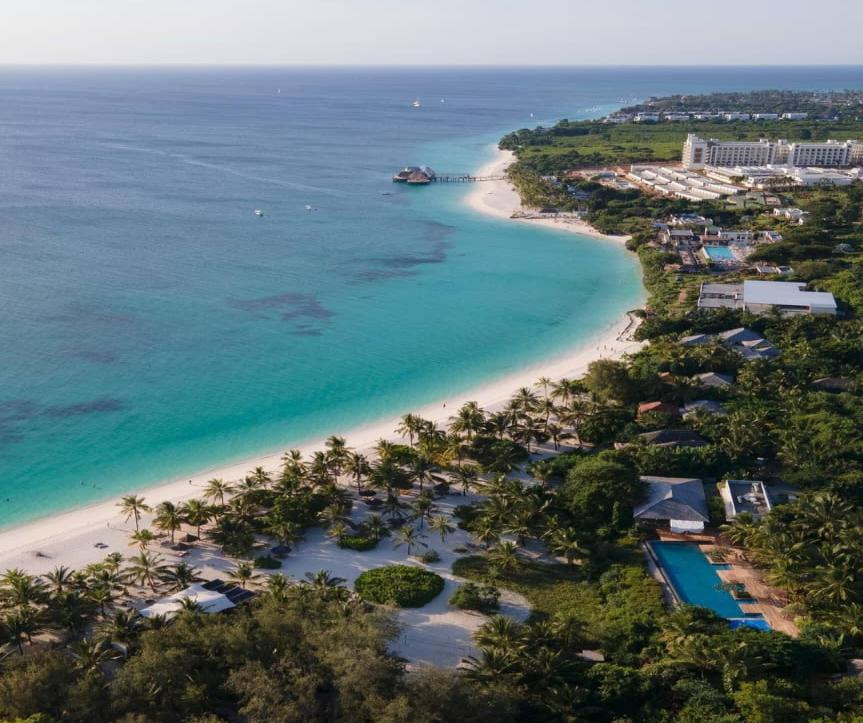

TOURISM STATISTICAL RELEASE OCTOBER 2025
Issued date – 12th November, 2025

TOURISM STATISTICS
Zanzibar recorded 86,740 international visitors in October 2025, an increase of 24.2 percent
compared with 69,860 visitors in October 2024 and an increase of 3.1 percent compared with
84,154 visitors recorded in the preceding month (September 2025).
European tourists dominated the market by accounting for 67.2 percent of the total visitors in
October 2025. Country-wise, Italy dominated the tourism market by accounting for 10.3
percent of all visitors entered in October 2025, followed by Germany (8.7 percent), while
Japanese recorded less than one percent (0.2 percent), the least. Other performances are shown
in Table 1.
The data shows that in October 2025, 79,753 visitors, equivalent to 91.9 percent of the total
visitors entered through the Airport. 60,810 visitors entered by international flights and 18,943
by domestic flights. The remaining 6,987 visitors entered through the seaport, 4 visitors entered
through a cruise ship and 6,983 entered through ferries from the Tanzania Mainland, as shown
in Figure 1 and Table 2.
Information on the purpose of visit (Table 3) shows that in October 2025, 86,150 visitors,
equivalent to 99.3 percent came for holidays, 0.4 percent for visiting friends and relatives and
0.3 percent for other purposes.
Table 4 and Figure 2 show that 48,127 visitors (55.5 percent) were male and 38,613 ( 44.5
percent) were female. The number of males increase by 26.4 and the number of females female
decreased by 16.2 percent compared with September 2025.
The ages of the visitors were categorized into three broad groups: those younger than 15 years
who are regarded as children, those 15 to 64 years who are regarded as the working age
population, and those 65 years and older who are considered retirees. The overall results show
that 5,452 visitors (6.3 percent) were aged less than 15 years, 75,515 visitors (87.0 percent)
were aged 15 to 64 years, and 5,773 visitors (6.7 percent) were aged 65 years and older (Figure
3 &Table 5).
The number of visitors from emerging markets in October 2025 (Poland, India, Russia, Israel,
China, and Ukraine) decreased by 4.4 percent compared with the number of visitors recorded
in September 2025. Other performances are shown in (Figure 4 & Annex I).
Table 6 shows that a higher percentage of visitors (34.0 percent) stayed in the country for 7
days in October 2025. Visitors’ average intended length of stay in October 2025 was 8.
1

A total of 913,911 bed spaces were available in October 2025. Estimates of 673,130 beds were
sold during October 2025, representing a bed occupancy rate of 73.7 percent (Table 7).
2

Table 1: International Visitors by Nationality October 2025, September 2025 and
October 2024.
% Change
% Change,
October 2024 September 2025 October 2025 October October 2025
Nationality 2025 and
and October
September
2024
Number %Share Rank Number % Share Rank Number % Share Rank 2025
EUROPE
Scandinavian 2,619 3.7 8 2,012 2.4 12 3,804 4.4 7 89.1 45.2
British 4,274 6.1 4 7,987 9.5 3 5,084 5.9 4 -36.3 19.0
German 8,362 12 2 8,698 10.3 2 7,512 8.7 2 -13.6 -10.2
Italian 6,370 9.1 3 8,889 10.6 1 8,894 10.3 1 0.1 39.6
French 10,093 14.4 1 5,940 7.1 4 7,241 8.3 3 21.9 -28.3
Dutch 2,441 3.5 9 2,764 3.3 8 3,139 3.6 9 13.6 28.6
Belgium 868 1.2 15 1,545 1.8 14 1,351 1.6 15 -12.6 55.6
Russian 479 0.7 20 1,275 1.5 15 1,338 1.5 16 4.9 179.3
Turkish 384 0.5 21 961 1.1 18 975 1.1 19 1.5 153.9
Polish 3,530 5.1 6 4,475 5.3 5 4,249 4.9 6 -5.1 20.4
Ukrainian 301 0.4 22 225 0.3 23 735 0.8 20 226.7 144.2
Czech Republic 987 1.4 13 1,175 1.4 16 1,626 1.9 12 38.4 64.7
Spanish 1,882 2.7 11 2,273 2.7 11 2,008 2.3 11 -11.7 6.7
Other European 6,667 9.5 7,561 9.0 10,376 12.0 37.2 55.6
Subtotal 49,257 70.5 55,780 66.3 58,332 67.2 5 18
ASIA
Japanese 511 0.7 19 367 0.4 22 208 0.2 24 -43.3 -59.3
Chinese 1,450 2.1 12 2,314 2.7 10 1,433 1.7 14 -38.1 -1.2
Indian 631 0.9 17 1,128 1.3 17 1,306 1.5 17 15.8 107.0
Israeli 561 0.8 18 1,712 2.0 13 1,574 1.8 13 -8.1 180.6
Other Asian 1,425 2 3,505 4.2 2,910 3.4 -17.0 104.2
Subtotal 4,578 6.6 9,026 10.7 7,431 8.6 -17.7 62.3
AFRICA
Kenyan 2,966 4.2 7 2,484 3.0 9 2,741 3.2 10 10.3 -7.6
South African 2,387 3.4 10 3,499 4.2 6 4,294 5.0 5 22.7 79.9
Egyptian 196 0.3 23 647 0.8 21 481 0.6 22 -25.7 145.4
Other African 4,330 6.2 6,664 7.9 7,084 8.2 6.3 63.6
Subtotal 9,879 14.1 13,294 15.8 14,600 16.8 9.8 47.8
AMERICA
American 3,577 5.1 5 3,356 4.0 7 3,156 3.6 8 -6.0 -11.8
Canadian 901 1.3 14 720 0.9 20 1,058 1.2 18 46.9 17.4
Other American 732 1 1,056 1.3 969 1.1 -8.2 32.4
Subtotal 5,210 7.5 5,132 6.1 5,183 6.0 1.0 -0.5
OCEANIA
Australian 746 1.1 16 831 1.0 19 730 0.8 21 -12.2 -2.1
New Zealand 190 0.3 24 75 0.1 24 456 0.526 23 508.0 140.0
Subtotal 936 1.3 906 1.1 1,186 1.4 30.9 26.7
Not stated 0 0 16 0.0 8 0.0
TOTAL 69,860 100 84,154 100.0 86,740 100.0 3.1 24.2
3

Figure 1: International Visitors by Entry Points, October 2025
Total International Domestic
79,753
60,810
18,943
6,987 6,983
4
Airport Seaport
4

Table 2: International Visitors by Nationality through Entry Points, October 2025
|                              |     | Airport          |     |        |              | Seaport      |     |        |     |
| ---------------------------- | --- | ---------------- | --- | ------ | ------------ | ------------ | --- | ------ | --- |
| Nation ality  International  |     |                  |     |        |              |              |     |        |     |
|                              |     | Domestic Flight  |     | Total  | Cruise Ship  | Sea ferries  |     | Total  |     |
Flight
| EUROPE  |     |     |     |     |     |     |     |     |     |
| ------- | --- | --- | --- | --- | --- | --- | --- | --- | --- |
Scandinavian  2,352  1,111  3,463               0     341             341
| British  | 4,228  |     | 494  |     | 4,722  | 0   | 362  |            362   |     |
| -------- | ------ | --- | ---- | --- | ------ | --- | ---- | ---------------- | --- |
| German   | 6,420  |     | 617  |     | 7,037  | 0   | 475  |            475   |     |
| Italian  | 7,876  |     | 875  |     | 8,751  | 0   | 143  |            143   |     |
French  6,003  835  6,838                 1   402             403
| Dutch    | 2,331  |     | 575  |     | 2,906  | 0   | 233  |            233    |     |
| -------- | ------ | --- | ---- | --- | ------ | --- | ---- | ----------------- | --- |
| Belgium  | 1,050  |     | 181  |     | 1,231  | 0   | 120  |            120    |     |
| Russian  | 1,120  |     | 181  |     | 1,301  | 0   | 37   |              37   |     |
| Turkish  | 527    |     | 378  |     | 905    | 0   | 70   |              70   |     |
Polish  3,834  381  4,215                 1   33               34
| Ukrainian       | 340    |     | 379  |     | 719    | 0   | 16  |              16   |     |
| --------------- | ------ | --- | ---- | --- | ------ | --- | --- | ----------------- | --- |
| Czech Republic  | 1,360  |     | 250  |     | 1,610  | 0   | 16  |              16   |     |
| Spanish         | 1,208  |     | 727  |     | 1,935  | 0   | 73  |              73   |     |
Other Europeans  6,875  3,149  10,024  0  352             352
| Subtotal  | 45,524  |     | 10,133  | 55,657  |        | 2   | 2,673  |                   | 2,675  |
| --------- | ------- | --- | ------- | ------- | ------ | --- | ------ | ----------------- | ------ |
| ASIA      |         |     |         |         |        |     |        |                   |        |
| Japanese  | 68      |     | 84      |         | 152    | 0   | 56     |              56   |        |
| Chinese   | 779     |     | 365     |         | 1,144  | 0   | 289    |            289    |        |
| Indian    | 689     |     | 285     |         | 974    | 0   | 332    |            332    |        |
| Israeli   | 1,276   |     | 279     |         | 1,555  | 0   | 19     |              19   |        |
Other Asians  1,360  1,230  2,590                 1   319             320
| Subtotal       | 4,172  |     | 2,243  |     | 6,415  | 1   | 1,015  |                  | 1,016  |
| -------------- | ------ | --- | ------ | --- | ------ | --- | ------ | ---------------- | ------ |
| AFRICA         |        |     |        |     |        |     |        |                  |        |
| Kenyan         | 1,347  |     | 753    |     | 2,100  | 0   | 641    |            641   |        |
| South African  | 3,185  |     | 920    |     | 4,105  | 0   | 189    |            189   |        |
Egyptian  249  134  383                 1   97               98
Other Africans  2,883  2,604  5,487  0  1597          1,597
| Subtotal         | 7,664   |     | 4,411   | 12,075  |        | 1   | 2,524  |                   | 2,525  |
| ---------------- | ------- | --- | ------- | ------- | ------ | --- | ------ | ----------------- | ------ |
| AMERICA          |         |     |         |         |        |     |        |                   |        |
| American         | 1,975   |     | 805     |         | 2,780  | 0   | 376    |            376    |        |
| Canadian         | 557     |     | 356     |         | 913    | 0   | 145    |            145    |        |
| Other Americans  | 550     |     | 328     |         | 878    | 0   | 91     |              91   |        |
| Subtotal         | 3,082   |     | 1,489   |         | 4,571  | 0   | 612    |                   | 612    |
| OCEANIA          |         |     |         |         |        |     |        |                   |        |
| Australian       | 310     |     | 285     |         | 595    | 0   | 135    |            135    |        |
| New Zealand      | 50      |     | 382     |         | 432    | 0   | 24     |              24   |        |
| Subtotal         | 360     |     | 667     |         | 1,027  | 0   | 159    |                   | 159    |
| Not stated       |         | 8   | 0       |         | 8      | 0   | 0      |                   | 0      |
| TOTAL            | 60,810  |     | 18,943  | 79,753  |        | 4   | 6,983  |                   | 6,987  |

5

Table 3: International Visitors by Nationality and Purpose of Visit, October 2025
Visiting
|     | Friends and  | Seeking  | Temporary  | Business and  | In  |     |     |
| --- | ------------ | -------- | ---------- | ------------- | --- | --- | --- |
Nationality  Holidays  Relatives  Employment  Employment  Conference  Transit  Others  Total
| EUROPE           |         |      |     |     |       |              |      |
| ---------------- | ------- | ---- | --- | --- | ----- | ------------ | ---- |
| Scandinavian     | 3,786   | 14   | 0   | 0   | 0  0  | 4  3,804     |      |
| British          | 5,065   | 11   | 0   | 0   | 4  0  | 4  5,084     |      |
| German           | 7,481   | 15   | 2   | 2   | 0  2  | 10  7,512    |      |
| Italian          | 8,838   | 35   | 8   | 0   | 0  0  | 13  8,894    |      |
| French           | 7,208   | 27   | 0   | 0   | 0  0  | 6  7,241     |      |
| Dutch            | 3,109   | 27   | 2   | 0   | 0  0  | 1  3,139     |      |
| Belgium          | 1,348   | 3    | 0   | 0   | 0  0  | 0  1,351     |      |
| Russian          | 1,334   | 4    | 0   | 0   | 0  0  | 0  1,338     |      |
| Turkish          | 961     | 14   | 0   | 0   | 0  0  | 0            | 975  |
| Polish           | 4,227   | 18   | 0   | 0   | 0  0  | 4  4,249     |      |
| Ukrainian        | 730     | 5    | 0   | 0   | 0  0  | 0            | 735  |
| Czech Republic   | 1,615   | 8    | 0   | 0   | 0  0  | 3  1,626     |      |
| Spanish          | 1,992   | 16   | 0   | 0   | 0  0  | 0  2,008     |      |
| Other Europeans  | 10,214  | 21   | 0   | 0   | 0  3  | 138  10,376  |      |
| Subtotal         | 57,908  | 218  | 12  | 2   | 4  5  | 183  58,332  |      |
| ASIA             |         |      |     |     |       |              |      |
| Japanese         | 208     | 0    | 0   | 0   | 0  0  | 0            | 208  |
| Chinese          | 1,428   | 5    | 0   | 0   | 0  0  | 0  1,433     |      |
| Indian           | 1,295   | 11   | 0   | 0   | 0  0  | 0  1,306     |      |
| Israeli          | 1,567   | 7    | 0   | 0   | 0  0  | 0  1,574     |      |
| Other Asians     | 2,894   | 9    | 0   | 0   | 0  0  | 7  2,910     |      |
| Subtotal         | 7,392   | 32   | 0   | 0   | 0  0  | 7  7,431     |      |
| AFRICA           |         |      |     |     |       |              |      |
| Kenyan           | 2,737   | 2    | 0   | 0   | 0  0  | 2  2,741     |      |
| South African    | 4,259   | 30   | 0   | 0   | 0  1  | 4  4,294     |      |
| Egyptian         | 481     | 0    | 0   | 0   | 0  0  | 0            | 481  |
| Other Africans   | 7,021   | 54   | 0   | 1   | 1  0  | 7  7,084     |      |
| Subtotal         | 14,498  | 86   | 0   | 1   | 1  1  | 13  14,600   |      |
| AMERICA          |         |      |     |     |       |              |      |
| American         | 3,139   | 17   | 0   | 0   | 0  0  | 0  3,156     |      |
| Canadian         | 1,050   | 8    | 0   | 0   | 0  0  | 0  1,058     |      |
| Other Americans  | 969     | 0    | 0   | 0   | 0  0  | 0            | 969  |
| Subtotal         | 5,158   | 25   | 0   | 0   | 0  0  | 0  5,183     |      |
| OCEANIA          |         |      | 0   |     |       | 0            |      |
| Australian       | 730     | 0    | 0   | 0   | 0  0  | 0            | 730  |
| New Zealand      | 456     | 0    | 0   | 0   | 0  0  | 0            | 456  |
| Subtotal         | 1,186   | 0    | 0   | 0   | 0  0  | 0  1,186     |      |
| Not stated       | 8       | 0    | 0   | 0   | 0  0  | 0            | 8    |
| TOTAL            | 86,150  | 361  | 12  | 3   | 5  6  | 203  86,740  |      |
TOTAL
| PERCENT  | 99.3  | 0.4  | 0.0  | 0.0  | 0.0  0.0  | 0.3  | 100  |
| -------- | ----- | ---- | ---- | ---- | --------- | ---- | ---- |

6

Table 4: International Visitors by Nationality and Sex, October 2025
| Nationality  |     | Male  | Female  |     |     | Total  |
| ------------ | --- | ----- | ------- | --- | --- | ------ |
EUROPE
|               |                 |     |                 |     |     |        |
| ------------- | --------------- | --- | --------------- | --- | --- | ------ |
| Scandinavian  |         2,104   |     |         1,700   |     |     | 3,804  |
| British       |         3,046   |     |         2,038   |     |     | 5,084  |
| German        |         4,338   |     |         3,174   |     |     | 7,512  |
Italian
|          |         4,862    |     |         4,032    |     |     | 8,894  |
| -------- | ---------------- | --- | ---------------- | --- | --- | ------ |
| French   |         4,104    |     |         3,137    |     |     | 7,241  |
| Dutch    |         1,695    |     |         1,444    |     |     | 3,139  |
| Belgium  |            791   |     |            560   |     |     | 1,351  |
| Russian  |            686   |     |            652   |     |     | 1,338  |
Turkish
|                 |            690   |     |            285   |     |     | 975    |
| --------------- | ---------------- | --- | ---------------- | --- | --- | ------ |
| Polish          |         2,166    |     |         2,083    |     |     | 4,249  |
| Ukrainian       |            342   |     |            393   |     |     | 735    |
| Czech Republic  |            804   |     |            822   |     |     | 1,626  |
| Spanish         |         1,210    |     |            798   |     |     | 2,008  |
Other European Countries          5,625           4,751   10,376
| Subtotal  |       32,463     |     |       25,869      |     |     | 58,332  |
| --------- | ---------------- | --- | ----------------- | --- | --- | ------- |
| ASIA      |                  |     |                   |     |     |         |
| Japanese  |            127   |     |              81   |     |     | 208     |
Chinese
|     |         1,000   |     |            433   |     |     | 1,433  |
| --- | --------------- | --- | ---------------- | --- | --- | ------ |
Indian
|                |            858   |     |            448   |     |     | 1,306  |
| -------------- | ---------------- | --- | ---------------- | --- | --- | ------ |
| Israeli        |            910   |     |            664   |     |     | 1,574  |
| Other Asian    |         1,662    |     |         1,248    |     |     | 2,910  |
| Subtotal       |         4,557    |     |         2,874    |     |     | 7,431  |
| AFRICA         |                  |     |                  |     |     |        |
| Kenyan         |         1,420    |     |         1,321    |     |     | 2,741  |
| South African  |         1,853    |     |         2,441    |     |     | 4,294  |
| Egyptian       |            313   |     |            168   |     |     | 481    |
| Other African  |         3,897    |     |         3,187    |     |     | 7,084  |
Subtotal
|     |         7,483   |     |         7,117   |     |     | 14,600  |
| --- | --------------- | --- | --------------- | --- | --- | ------- |
AMERICA
|     |     |     |     |     |     |     |
| --- | --- | --- | --- | --- | --- | --- |
American
|                  |         1,824    |     |         1,332    |     |     | 3,156  |
| ---------------- | ---------------- | --- | ---------------- | --- | --- | ------ |
| Canadian         |            577   |     |            481   |     |     | 1,058  |
| Other American   |            529   |     |            440   |     |     | 969    |
| Subtotal         |         2,930    |     |         2,253    |     |     | 5,183  |
| OCEANIA          |                  |     |                  |     |     |        |
| Australian       |            423   |     |            307   |     |     | 730    |
| New Zealand      |            267   |     |            189   |     |     | 456    |
| Subtotal         |            690   |     |            496   |     |     | 1,186  |
Not stated
|     |                4   |     |                4   |     |     | 8   |
| --- | ------------------ | --- | ------------------ | --- | --- | --- |
TOTAL OCTOBER 2025
|     |       48,127   |     |       38,613   |     |     | 86,740  |
| --- | -------------- | --- | -------------- | --- | --- | ------- |
TOTAL SEPTEMBER 2025
|     |     | 38,077  | 46,077  |     |     | 84,154  |
| --- | --- | ------- | ------- | --- | --- | ------- |
TOTAL PERCENT
|     |           55.5   |     |           44.5   |     |            100   |     |
| --- | ---------------- | --- | ---------------- | --- | ---------------- | --- |
% CHANGE, OCTOBER 2025 AND
SEPTEMBER 2025
|     |     | 26.4  |     | -16.2  |     | 3.1  |
| --- | --- | ----- | --- | ------ | --- | ---- |

7

Figure 2: International Visitors by Sex, October 2025
Female
44.5%
Male
55.5%
Figure 3: International Visitors by Categorized Age, October 2025
6.7% 6.3%
87.0%
<15yrs 15-64yrs 65+yrs
8

Table 5: International Visitors by Nationality and Categorized Age, October 2025
Nationality <15 yrs 15 -64 yrs 65+ yrs Total
EUROPE
Scandinavian 357 3,144 303 3,804
British 366 4,235 483 5,084
German 557 6,386 569 7,512
Italian 403 7,861 630 8,894
French 869 5,891 481 7,241
Dutch 210 2,693 236 3,139
Belgium 92 1,150 109 1,351
Russian 107 1,226 5 1,338
Turkish 27 897 51 975
Polish 187 3,855 207 4,249
Ukrainian 52 673 10 735
Czech Republic 126 1,426 74 1,626
Spanish 38 1,887 83 2,008
Other European 716 9,002 658 10,376
Subtotal 4,107 50,326 3,899 58,332
ASIA
Japanese 0 200 8 208
Chinese 37 1,391 5 1,433
Indian 78 1,142 86 1,306
Israeli 127 1,326 121 1,574
Other Asian 133 2,636 141 2,910
Subtotal 375 6,695 361 7,431
AFRICA
Kenyan 165 2,512 64 2,741
South African 279 3,712 303 4,294
Egyptian 14 463 4 481
Other African 214 6,663 207 7,084
Subtotal 672 13,350 578 14,600
AMERICA
American 215 2,434 507 3,156
Canadian 32 833 193 1,058
Other American 34 871 64 969
Subtotal 281 4,138 764 5,183
OCEANIA
Australian 17 623 90 730
New Zealand 0 375 81 456
Subtotal 17 998 171 1,186
Not stated 0 8 0 8
TOTAL 5,452 75,515 5,773 86,740
TOTAL (%) 6.3 87.0 6.7 100
9

Figure 4: Visitors Arrival from Emerging Markets, October 2025 and October 2024
4,249 October-24 October-25
3,530
1,574
1,4501,433
1,306 1,338
735
631
561
479
301
Polish Chinese Indian Israeli Russian Ukrainian
10

Table 6: Intended Length of Stay and Sex of International Visitors, October 2025
Number of Arrival Total Nights
Percentage
Share
Male Female Total Male Female Total
1 409 249 658 0.8 409 249 658
2 645 488 1,133 1.3 1,290 976 2,266
3 859 871 1,730 2.0 2,577 2,613 5,190
4 1,358 1,733 3,091 3.6 5,432 6,932 12,364
5 3,946 4,570 8,516 9.8 19,730 22,850 42,580
6 4,600 2,115 6,715 7.7 27,600 12,690 40,290
7 18,717 10,815 29,532 34.0 131,019 75,705 206,724
8 9,125 8,812 17,937 20.7 73,000 70,496 143,496
9 1,820 1,758 3,578 4.1 16,380 15,822 32,202
10 1,904 1,892 3,796 4.4 19,040 18,920 37,960
11 609 767 1,376 1.6 6,699 8,437 15,136
12 782 904 1,686 1.9 9,384 10,848 20,232
13 366 400 766 0.9 4,758 5,200 9,958
14 1,301 1,404 2,705 3.1 18,214 19,656 37,870
15 659 767 1,426 1.6 9,885 11,505 21,390
16 220 220 440 0.5 3,520 3,520 7,040
17 103 109 212 0.2 1,751 1,853 3,604
18 63 66 129 0.1 1,134 1,188 2,322
19 50 76 126 0.1 950 1,444 2,394
20 94 95 189 0.2 1,880 1,900 3,780
21 140 148 288 0.3 2,940 3,108 6,048
22 43 39 82 0.1 946 858 1,804
23 14 34 48 0.1 322 782 1,104
24 13 17 30 0.0 312 408 720
25 30 17 47 0.1 750 425 1,175
26 10 6 16 0.0 260 156 416
27 17 9 26 0.0 459 243 702
28 10 39 49 0.1 280 1,092 1,372
29 10 67 77 0.1 290 1,943 2,233
30 199 117 316 0.4 5,970 3,510 9,480
31+ 11 9 20 0.0 341 279 620
Total 48,127 38,613 86,740 100.0 367,522 305,608 673,130
Intended Average Length of Stay1 7.6 7.9 7.8
1 The average intended length of stay is determined by dividing the number of visitor nights by the number of
international visitors
11

Table 7: International Visitors’ Nights and Estimated Bed Occupancy Rate, October
2025
Length of Stay  Number of visitors  Percentage Share  Total Nights
| 1      |                  658    | 0.8    |                658   |
| ------ | ----------------------- | ------ | -------------------- |
| 2      |               1,133     | 1.3    |             2,266    |
| 3      |               1,730     | 2.0    |             5,190    |
| 4      |               3,091     | 3.6    |           12,364     |
| 5      |               8,516     | 9.8    |           42,580     |
| 6      |               6,715     | 7.7    |           40,290     |
| 7      |             29,532      | 34.0   |         206,724      |
| 8      |             17,937      | 20.7   |         143,496      |
| 9      |               3,578     | 4.1    |           32,202     |
| 10     |               3,796     | 4.4    |           37,960     |
| 11     |               1,376     | 1.6    |           15,136     |
| 12     |               1,686     | 1.9    |           20,232     |
| 13     |                  766    | 0.9    |             9,958    |
| 14     |               2,705     | 3.1    |           37,870     |
| 15     |               1,426     | 1.6    |           21,390     |
| 16     |                  440    | 0.5    |             7,040    |
| 17     |                  212    | 0.2    |             3,604    |
| 18     |                  129    | 0.1    |             2,322    |
| 19     |                  126    | 0.1    |             2,394    |
| 20     |                  189    | 0.2    |             3,780    |
| 21     |                  288    | 0.3    |             6,048    |
| 22     |                    82   | 0.1    |             1,804    |
| 23     |                    48   | 0.1    |             1,104    |
| 24     |                    30   | 0.0    |                720   |
| 25     |                    47   | 0.1    |             1,175    |
| 26     |                    16   | 0.0    |                416   |
| 27     |                    26   | 0.0    |                702   |
| 28     |                    49   | 0.1    |             1,372    |
| 29     |                    77   | 0.1    |             2,233    |
| 30     |                  316    | 0.4    |             9,480    |
| 31+    |                    20   | 0.0    |                620   |
| Total  | 86,740                  | 100.0  | 673,130              |
Number of beds available in October 2025
913,911
Bed Occupancy Rate  73.7

12

Annex I: Visitors Arrival from Emerging Markets, October 2024, October 2025 &
September 2025
% Change
% Change
October
October 2025
Nationality  October 2024  September 2025  October 2025  2025 and
and October
September
2024
2025
|  Russian     |     |           479   |     | 1,275   |     | 1,338   |     | 179.3  |     | 4.9    |
| ------------ | --- | --------------- | --- | ------- | --- | ------- | --- | ------ | --- | ------ |
|  Polish      |     | 3,530           |     | 4,475   |     | 4,249   |     | 20.4   |     | -5.1   |
|  Ukrainian   |     | 301             |     | 225     |     | 735     |     | 144.2  |     | 226.7  |
|  Chinese     |     | 1,450           |     | 2314    |     | 1,433   |     | -1.2   |     | -38.1  |
|  Indian      |     | 631             |     | 1128    |     | 1,306   |     | 107.0  |     | 15.8   |
|  Israeli     |     | 561             |     | 1,712   |     | 1,574   |     | 180.6  |     | -8.1   |
|  Total       |     | 6,952           |     | 11,129  |     | 10,635  |     | 53.0   |     | -4.4   |

Annex II: International Visitors by Month, 2020 - 2025
%
| Month  | 2020  |     | 2021  |     | 2022  | 2023  | 2024  |     | 2025  |     |
| ------ | ----- | --- | ----- | --- | ----- | ----- | ----- | --- | ----- | --- |
Change
January  61,461  49,868  42,443  68,813  73,468  84,069  14.4
February  61,752  51,574  46,995  65,430  71,095  82,750  16.4
| March  | 33,801  |      | 43,821  |     | 38,762  | 45,915  | 51,873  |     | 60,345  | 16.3  |
| ------ | ------- | ---- | ------- | --- | ------- | ------- | ------- | --- | ------- | ----- |
| April  |         | 334  | 13,839  |     | 20,540  | 27,666  | 28,995  |     | 37,137  | 28.1  |
| May    |         | 197  | 9,280   |     | 20,450  | 26,620  | 29,995  |     | 37,038  | 23.5  |
| June   |         | 353  | 20,416  |     | 34,013  | 47,595  | 51,559  |     | 67,496  | 30.9  |
| July   | 3,079   |      | 29,714  |     | 58,157  | 58,711  | 68,223  |     | 98,370  | 44.2  |
August  4,366  34,425  61,388  61,466  72,296  105,506  45.9
September  5,422  25,817  46,338  53,839  60,731  84,154  38.6
October  12,157  31,826  57,547  54,961  69,860  86,740  24.2
| November  | 29,128  |     | 35,438  |     | 55,150  | 57,296  | 67,049  |     |     | 0.0  |
| --------- | ------- | --- | ------- | --- | ------- | ------- | ------- | --- | --- | ---- |
| December  | 48,594  |     | 48,167  |     | 66,720  | 70,186  | 91,611  |     |     | 0    |
Total  260,644  394,185  548,503  638,498  736,755  743,605   100.0

13

Glossary
Information on the number of visitors, their nationality, and age distribution are among the
important economic indicators. The tourism industry has contributed significantly to
Zanzibar’s economy and it is therefore necessary that such information is made available
promptly. This report provides detailed information on the age and sex distribution; mode of
travel; nationality and regional distribution; and purpose of travel of visitors are also provided.
The information was captured using the Arrival Declaration Cards on visitors who entered
Zanzibar through both the airport and sea ports.
Definition and Concepts
Tourist: refers to any person traveling to a place other than that of his/her usual environment
for less than 12 months and whose main purpose of the trip is other than the exercise of an
activity remunerated from within the place visited. (According to the United Nations World
Tourism Organization -UNWTO)
Visitor: refers to any person traveling to a place other than that of his/her usual environment
for less than twelve months and whose main purpose of the trip is other than the exercise of an
activity remunerated from within the place visited.
This release categories visitors into four groups in terms of mode of transport:
(i) International flight – comprising visitors entering the country directly from abroad;
(ii) Domestic flight – comprising of visitors entering Zanzibar via Tanzania Mainland;
(iii) Cruise ship – comprising of visitors (excursionists) entered Zanzibar by cruise
ship; and
(iv) Sea ferries – comprising visitors entered Zanzibar by using local sea boats.
For more clarifications please contact:
Office of the Chief Government Statistician Zanzibar Commission for Tourism
P.O. BOX 2321 P.O.BOX 1410
Email: zanstat@ocgs.go.tz Email:
marketing@zanzibartourism.go.tz
14

## Extracted Images

### Page 1

