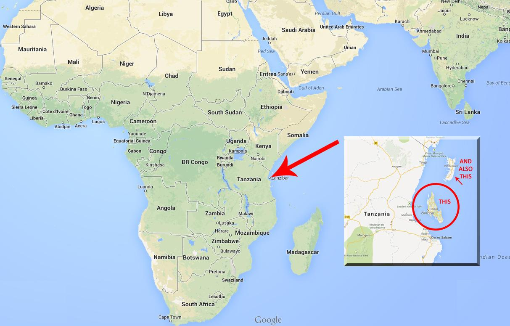
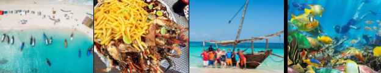
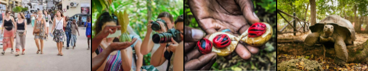
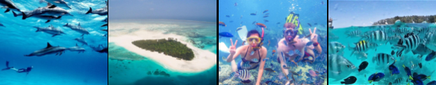
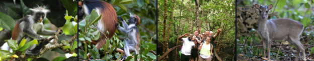

ZANZIBAR TRAVEL GUIDE
Zanzibar, also known as the SpiceIslands,locatedabout22miles(35km)offtheeastcoast
of Tanzania - East Africa. Zanzibar is an archipelago consisting of thetwomainislandsand
50othersmallislands,themainislandsareUngujaandPembaIsland.
Zanzibar is famous for its History, Cultures, luxurious beach resorts and tourism activities
like deep-sea fishing, diving, snorkeling, sandbanks. Stone Town is the historic heart of
Zanzibar's capital city, located on Unguja Island, about 7 km from Zanzibar International
Airport.
Contacts:
Address:KiembeSamaki,RoyalBuilding,OldAirportroad,Zanzibar-Tanzania.
Whatsapp+255746823907|info@zanziworldtours.com|zanzibarworld.com

The town is renowned for its unique architecture, which is a blend of Arab, Indian,
European,andAfricaninfluences.
The buildings are predominantly made of coral stone, giving the town its distinctive
appearance.In 2000, Stone Town was designated as a UNESCO World Heritage Site due to
itsculturalandhistoricalsignificance.
ThisguideisforyouifyouareplanningyournextvacationtoZanzibarislands!
FACTS ABOUT ZANZIBAR
Time:
ThetimezoneforZanzibar,TanzaniaisGMT+3
Electricity:
230volts,50Hz.Rectangularorroundthree-pinplugsareused.
Language:
Swahili and English are the official languages. You may find some locals on thebeachwho
mayspeakFrench,German,Italian,Spanish,Russian.
Communication:
The international country dialing code for Tanzania, as well as Zanzibar, is +255. There is
good mobile phone coverage in main tourist areas; Stone Town, Nungwi, Kendwa,
Matemwe, Kiwengwa, Uroa/ Pongwe, Michamvi, Bwejuu, Paje, Jambiani, Makunduchi &
Kizimkazi.
YoucanbuyaSimCardattheAirport,itcosts$15.
Money:
The official currency is the Tanzanian Shilling (TZS). The tourism industry priceseverything
in US Dollars and this is the preferred unit of currency. Money can be exchanged in the
Airport,StoneTown,Nungwi,Kiwengwa&Pajebeach.
Contacts:
Address:KiembeSamaki,RoyalBuilding,OldAirportroad,Zanzibar-Tanzania.
Whatsapp+255746823907|info@zanziworldtours.com|zanzibarworld.com

ATMs are also available in those places. Most lodges, some hotelsandfamousrestaurants
acceptcards.Butwerecommendyoucarrysomecashforsmallpurchases.
Climate:
The climate is tropical, hot all year round, with a hotter period from December to March,
and a relatively cool period from May to August. There are two rainy seasons: one more
intense, known as the "long rains" season, from late March to May, with the peak in April,
and the other less intense, known as the "short rains" season, between mid-October and
earlyDecember.
Popular flights:
Most popular international flights to Zanzibar are; Qatar Airways, Fly Dubai, Fly Emirates,
Condor,KLMRoyalDutchAirlines,Lufthansa,AirFrance,NeosAir,EthiopianAirlines.
Safety:
”Is Zanzibar safe to travel?” This is a common question that is regularly asked by the
travellers who want to visit Zanzibar. The short answer? Yes! Zanzibar, or Tanzania as a
whole, is the safest destination in Africa, with more than 1 million tourists visiting the
country every year from different parts of the world, UK, Germany, France, Italy, UAE, and
soon.
Local customs:
Tanzanians are known to be friendly and generally welcoming, but travellers should be
sensitive to local cultural mores. Visitors to Zanzibar should be aware that it is a
predominantlyMuslimregionandvisitorsshoulddressmodestlyandrespectfully.
Beachwear is fine on the beach or around a hotel pool, butnotacceptableelsewhere.You
can buy a local sarong,calledakanga,whichcanbeusedtocovershoulderswhenneeded,
or otherwise be used as a scarf or towel. Tourists should be especially careful during
Ramadanwhenpublicdrinking,smokingandeveneatingshouldbeavoided.
HomosexualityisillegalinTanzania.
Contacts:
Address:KiembeSamaki,RoyalBuilding,OldAirportroad,Zanzibar-Tanzania.
Whatsapp+255746823907|info@zanziworldtours.com|zanzibarworld.com

Vaccinations:
A yellow fever vaccination certificate is only required for travellers one year of age and
older coming from – orwhoareinairporttransitformorethan12hourswithin–acountry
withriskofyellowfevertransmission.
In addition to standard vaccinationssuchasMMRandTDP,theCDCandWHOrecommend
vaccinations for Tanzania, such as Hepatitis A, hepatitis B, and typhoid. Yellow fever and
rabies vaccinations are also recommended depending on the traveller’s activities. As of
January 2023 there are no more COVID-19 restrictions in Tanzania, and vaccinations or
PCR-testsarenolongernecessarybeforetraveling.
As with all international travel, we always advise you to consult your physician for
professionalhealthadvicebeforetravellingtoTanzania.
Visa/ Passport requirements:
Most visitors entering Tanzania require a visa. Your visa can be requested online through
the officialvisawebsitefromtheTanzaniangovernment(https://visa.immigration.go.tz/).
Passportsmustcontainoneunusedvisapage.
Visitors may obtain a visa on arrival at Zanzibar airport, costing between $50 and $100
depending on nationality, payable in cash. All visitors also require proofofsufficientfunds
and should hold documentation for their return or onward journey. Passports should be
validforatleastsixmonthsfromdateofentry.
Thosearrivingfromaninfectedcountrymustholdayellowfevervaccinationcertificate.Itis
highly recommended that passports have at least six months validity remaining after your
intendeddateofdeparturefromyourtraveldestination.
Note:
There are some countrieswhosenationalsdonotrequireavisatoenterTanzania.Belowis
the list of these countries, they may be reviewed from time to time by the Tanzania
government.
Contacts:
Address:KiembeSamaki,RoyalBuilding,OldAirportroad,Zanzibar-Tanzania.
Whatsapp+255746823907|info@zanziworldtours.com|zanzibarworld.com

Antigua & Barbuda, Anguilla, Ashmore &CartiaIslands,Bahamas,Barbados,Bermuda,Belize,Brunei,British
Virgin Islands, British Indian Ocean Territory, Botswana, Burundi, Cyprus, Cayman Islands, Channel Islands,
Cocos Islands, Cook Islands, Christmas Islands, Dominica (Commonwealth of Dominica), Falkland Islands,
Gambia, Ghana, Gibraltar, Grenada, Guernsey, Guyana, Heard Island, Hong Kong, Isle of Man, Jamaica,
Jersey, Kenya, Kiribati, Lesotho, Malawi, Montserrat, Malaysia, Madagascar, Malta, Mauritius, Macao,
Mozambique, Nauru, Niue Island, Norfolk Island, Namibia, Papua new Guinea, Rwanda, Romania, Samoa,
Seychelles, Singapore, Swaziland, Solomon Island, St. Kitts & Nevis, St. Lucia, St. Vicent, St. Helena, South
Africa, South Sudan, Trinidad & Tobago, Turks & Caicos, Tokelau, Tonga, Tuvalu, Vanuatu, Uganda, Zambia,
Zimbabwe
There are some countries which their nationals cannot obtain a visa on arrival. These
countriesfallundertheso-calledReferralVisa.Belowisthelistofthesecountries,theymay
bereviewedfromtimetotimebytheTanzaniagovernment.
Afghanistan, Azerbaijan, Bangladesh, Chad, Djibouti, Eritrea, Equatorial Guinea, Iran, Iraq, Kazakhstan
Republic, Kyrgyz Republic (Kyrgyzstan), Lebanon, Mali, Mauritania, Niger, Nigeria, Pakistan, Palestine,
Senegal,Somalia,SriLanka,Somaliland,Syria,SierraLeone,Tajikistan,Turkmenistan,Uzbekistan,Yemen
Best Day Tours & Activities:
Tocheckmorethings,pleasevisit,zanzibarworld.com/tours
Full day - Blue Safari trip:
This is a full-day excursion to explore marine life in the Menai bay area. The tour includes
sailing, Sandbank relaxing and snorkeling in the crystal-clear waters to view the vibrant coral
reefs and a variety of fish and other marine life. Try fresh Seafood BBQ lunch with mouth
watering tropical fruits.
Contacts:
Address:KiembeSamaki,RoyalBuilding,OldAirportroad,Zanzibar-Tanzania.
Whatsapp+255746823907|info@zanziworldtours.com|zanzibarworld.com

| Full day | - Spice Farm, | Prison | Island & Stone Town: |
| -------- | ------------- | ------ | -------------------- |
This is the full day combined experiences trip; On the same day, you will visit Spice Farms,
Prison Island & Stone Town. This is more cost effective than visiting each attraction on separate
days. The Driver will come to pick you up from the Hotel in the morning and you will be back
| during   | the sunset. |          |               |
| -------- | ----------- | -------- | ------------- |
| Half day | - Mnemba    | Dolphins | & Snorkeling: |
Mnemba Dolphins & Snorkeling Tour is an exciting trip that we designed for your best holiday
experience in the paradise islands of Zanzibar. In this tour, you will start with swimming with wild
dolphins, and then to Snorkeling in the shallow water near Mnemba Island.
| Half day | - Jozani | Forest Tour: |     |
| -------- | -------- | ------------ | --- |
Don’t miss this half day trip to Discover Jozani Chwaka bay National park or simply known as
Jozani Forest. The park is home to the red colobus monkey, which is a species found only in
Zanzibar islands. You will visit mangrove forests and spot other various species of birds,
| including | the mangrove | kingfisher. |     |
| --------- | ------------ | ----------- | --- |
Contacts:
Address:KiembeSamaki,RoyalBuilding,OldAirportroad,Zanzibar-Tanzania.
Whatsapp+255746823907|info@zanziworldtours.com|zanzibarworld.com

zanzibarworld.com/tours
Tocheckmoretours,pleasevisit,
Best Restaurants:
| 1. The   | Rock | Restaurant  |     |     |       |              |
| -------- | ---- | ----------- | --- | --- | ----- | ------------ |
|          | 🗺    |             |     |     | 🍽     |              |
| Location |      | Reviewed5/5 |     |     | Meals | Specialdiets |
Michamvi 4Stars Lunch,Dinner,Brunch, VegetarianFriendly,Vegan
|                |      |             |            |     | LateNight            | Options                   |
| -------------- | ---- | ----------- | ---------- | --- | -------------------- | ------------------------- |
| 2. Fisherman's |      | Seafood     |            | &   | Grill                |                           |
|                | 🗺    |             |            |     | 🍽                    |                           |
| Location       |      | Reviewed5/5 |            |     | Meals                | Specialdiets              |
| Nungwi         |      |             | 5Stars     |     | Lunch,Dinner,Brunch, | VegetarianFriendly,Vegan  |
|                |      |             |            |     | Drinks               | Options,GlutenFreeOptions |
| 3. Cape        | Town | Fish        | Market     |     | Restaurant           |                           |
| Location       | 🗺    | Reviewed5/5 |            |     | Meals 🍽              | Specialdiets              |
| StoneTown      |      |             | 4Stars     |     | Lunch,Dinner,Drinks  | VegetarianOptions         |
| 4. Lukman      |      | Local       | Restaurant |     | (Local cuisines)     |                           |
| Location       | 🗺    | Reviewed5/5 |            |     | Meals 🍽              | Specialdiets              |
StoneTown 4Stars Breakfast,Lunch,Dinner. VegetarianFriendly,Vegan
Options,Halal.
| 5. Emerson |     | Spice       | Tea | House | Restaurant |              |
| ---------- | --- | ----------- | --- | ----- | ---------- | ------------ |
| Location   | 🗺   | Reviewed5/5 |     |       | Meals 🍽    | Specialdiets |
StoneTown 4.5Stars Breakfast,Lunch,Dinner. VegetarianFriendly,Vegan
Options,Halal.
Contacts:
Address:KiembeSamaki,RoyalBuilding,OldAirportroad,Zanzibar-Tanzania.
Whatsapp+255746823907|info@zanziworldtours.com|zanzibarworld.com

| Best Beaches |     | to check | out: |     |
| ------------ | --- | -------- | ---- | --- |
❖ Kendwabeach
❖
Nungwibeach
❖ KiwengwaBeach
❖
Pajebeach
❖ Jambianibeach
❖ MichamviKaeBeach
❖ Matemwebeach
❖ NakupendaSandbank
| Important | Swahili | words: |     |     |
| --------- | ------- | ------ | --- | --- |
5swahiliwordstohelpyouout.
Swahili English
Jambo Hello/Howareyou
| Asante |     |     | Thank you |     |
| ------ | --- | --- | --------- | --- |
HakunaMatata Noproblem/Noworries
Karibu Welcome/Youarewelcome
Kwaheri Bye/Seeyou
| Things | to pack | for Zanzibar: |     |     |
| ------ | ------- | ------------- | --- | --- |
Thesearethebasicthings.
| Sun protection |     | items | Clothings                | Electronics           |
| -------------- | --- | ----- | ------------------------ | --------------------- |
| Sunscreen      |     |       | Light,breathableclothing | Cameraorsmartphone    |
| Hat            |     |       | Swimwear                 | Powerbank             |
| Sunglasses     |     |       | Sarongsorcover-ups       | Waterproofphonecase   |
|                |     |       | Flip-flops               | Traveladapter:TypeD&G |
Contacts:
Address:KiembeSamaki,RoyalBuilding,OldAirportroad,Zanzibar-Tanzania.
Whatsapp+255746823907|info@zanziworldtours.com|zanzibarworld.com

| Where                        | to start | planning               | your vacation? |
| ---------------------------- | -------- | ---------------------- | -------------- |
| Startplanningbyvisitinghere, |          | zanzibarworld.com/plan |                |
Contacts:
Address:KiembeSamaki,RoyalBuilding,OldAirportroad,Zanzibar-Tanzania.
Whatsapp+255746823907|info@zanziworldtours.com|zanzibarworld.com

## Extracted Images

### Page 1

### Page 2

### Page 3

### Page 4

### Page 5

### Page 6

### Page 7

### Page 8

### Page 9

